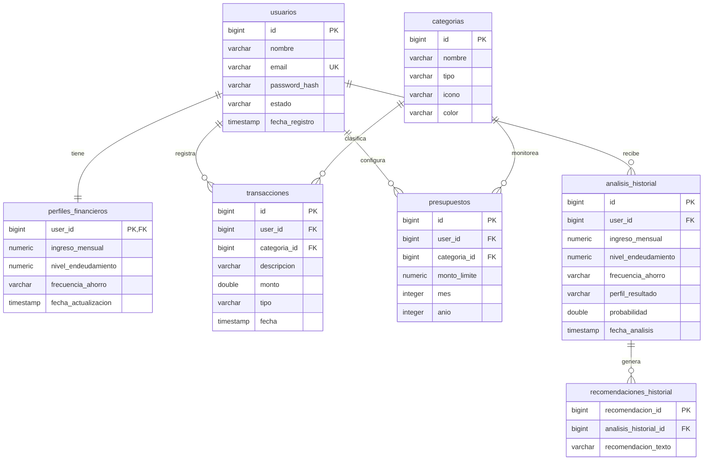

# 🗄️ Diseño y Normalización de la Base de Datos - Finance AI

Este documento detalla la estructura, diseño y normalización (hasta la **Tercera Forma Normal - 3NF**) del modelo de datos relacional para **Finance AI**.

A diferencia del modelo inicial propuesto (que sobredimensionaba el sistema al nivel de un Core Banking transaccional con partida doble y llaves de idempotencia), este diseño está centrado en resolver el problema del Hackathon: **análisis de comportamiento financiero, clasificación inteligente de gastos por IA y seguimiento evolutivo**.

---

## 🏛️ Proceso de Normalización (1NF, 2NF, 3NF)

Para asegurar la integridad de los datos, evitar anomalías de inserción/actualización/borrado y optimizar las consultas del Dashboard en OCI, el esquema original fue normalizado:

### 1. Primera Forma Normal (1NF)
*   **Requisito:** Todos los atributos deben contener valores atómicos (indivisibles). No se permiten grupos repetitivos ni colecciones de datos dentro de una celda.
*   **Aplicación:**
    *   En lugar de almacenar las transacciones como un texto plano o JSON agrupado por usuario, se desglosan en filas individuales en la tabla `transacciones`.
    *   Las sugerencias de ahorro no se guardan como un arreglo de texto JSON dentro de la tabla de análisis, sino en una tabla relacionada uno a muchos llamada `recomendaciones_historial`.

### 2. Segunda Forma Normal (2NF)
*   **Requisito:** Cumplir con la 1NF y garantizar que todos los atributos que no forman parte de la clave primaria dependan por completo de la clave primaria (sin dependencias parciales).
*   **Aplicación:**
    *   Todas las tablas utilizan identificadores de secuencia (`BIGINT` autoincremental / `sequence` de JPA) como clave primaria surrogate simple, sin claves compuestas parciales.

### 3. Tercera Forma Normal (3NF)
*   **Requisito:** Cumplir con la 2NF y eliminar cualquier dependencia transitiva (ningún atributo que no sea clave debe depender de otro atributo no clave).
*   **Aplicación:**
    *   **Categorías de Gastos:** Si guardamos el nombre de la categoría, su icono y su color dentro de la tabla `transacciones`, el icono y el color dependerían del nombre de la categoría. Para evitar esto, creamos la tabla independiente `categorias` y colocamos una clave foránea (`categoria_id`) en `transacciones`.
    *   **Límites de Presupuesto:** La regla de negocio exige evaluar límites mensuales configurados por el usuario para cada categoría. Se descompone la periodicidad en campos enteros `mes` y `anio` dentro de la tabla `presupuestos`.

---

## 📸 Preservación de Estado Histórico (Snapshotting)
Para cumplir con el requerimiento de *"Realizar un seguimiento de la evolución del comportamiento financiero a lo largo del tiempo"*, el sistema debe ser auditable. Si un usuario cambia su ingreso mensual de $4500 a $6000 en el Onboarding/Ajustes, los reportes de análisis pasados de meses anteriores no deben recalcularse dinámicamente con el nuevo valor.
Por ello, la tabla `analisis_historial` actúa como un **Snapshot** que guarda los parámetros financieros (`ingreso_mensual`, `nivel_endeudamiento`, `frecuencia_ahorro`) en el momento exacto en que se ejecutó el análisis.

---

## 📊 Descripción del Diccionario de Datos

El sistema consta de las siguientes 7 tablas:

### 1. Tabla: `usuarios`
Almacena los datos de registro y credenciales del usuario.
*   `id` (BIGINT, Primary Key): Identificador único del usuario por secuencia.
*   `nombre` (VARCHAR): Nombre completo del usuario.
*   `email` (VARCHAR, UNIQUE): Correo electrónico (índice único para login).
*   `password_hash` (VARCHAR): Contraseña encriptada.
*   `estado` (VARCHAR): Estado de la cuenta (ej: 'ACTIVO').
*   `fecha_registro` (TIMESTAMP): Fecha y hora del registro.

### 2. Tabla: `perfiles_financieros`
Almacena las variables de contexto económico declaradas durante el Onboarding o actualizadas en los Ajustes.
*   `user_id` (BIGINT, Primary Key, Foreign Key ➔ `usuarios.id`): Enlace 1:1 con el usuario.
*   `ingreso_mensual` (NUMERIC(12,2)): Ingreso neto actual del usuario.
*   `nivel_endeudamiento` (NUMERIC(5,2)): Porcentaje de ingresos destinado a deudas.
*   `frecuencia_ahorro` (VARCHAR): Frecuencia declarada ('BAJA', 'MEDIA', 'ALTA').
*   `fecha_actualizacion` (TIMESTAMP): Última actualización del perfil.

### 3. Tabla: `categorias`
Catálogo de categorías disponibles para clasificar gastos e ingresos.
*   `id` (BIGINT, Primary Key): Identificador de la categoría.
*   `nombre` (VARCHAR): Nombre de la categoría (ej: Alimentación, Transporte, Ocio).
*   `tipo` (VARCHAR): Tipo de movimiento ('INGRESO' o 'GASTO').
*   `icono` (VARCHAR): Identificador de icono.
*   `color` (VARCHAR): Código hexadecimal del color asignado.

### 4. Tabla: `presupuestos`
Límites de gastos configurados por el usuario.
*   `id` (BIGINT, Primary Key): Identificador único del presupuesto.
*   `user_id` (BIGINT, Foreign Key ➔ `usuarios.id`): Usuario que define el presupuesto.
*   `categoria_id` (BIGINT, Foreign Key ➔ `categorias.id`): Categoría del límite.
*   `monto_limite` (NUMERIC(12,2)): Límite mensual configurado.
*   `mes` (INTEGER): Mes correspondiente (1 al 12).
*   `anio` (INTEGER): Año correspondiente (ej: 2026).

### 5. Tabla: `transacciones`
Registra los egresos e ingresos del usuario.
*   `id` (BIGINT, Primary Key): Identificador de la transacción.
*   `user_id` (BIGINT, Foreign Key ➔ `usuarios.id`): Usuario dueño de la transacción.
*   `categoria_id` (BIGINT, Foreign Key ➔ `categorias.id`): Categoría asignada.
*   `descripcion` (VARCHAR): Detalle textual.
*   `monto` (DOUBLE PRECISION): Valor monetario del movimiento.
*   `tipo` (VARCHAR): Tipo de movimiento ('INGRESO' o 'GASTO').
*   `fecha` (TIMESTAMP): Fecha y hora del movimiento.

### 6. Tabla: `analisis_historial`
Almacena el registro histórico del perfil de salud financiera generado por el motor de IA.
*   `analisis_historial_id` (BIGINT, Primary Key): Identificador del reporte.
*   `user_id` (BIGINT, Foreign Key ➔ `usuarios.id`): Enlace al usuario.
*   `ingreso_mensual` (NUMERIC(12,2)): Ingreso al momento del análisis.
*   `nivel_endeudamiento` (NUMERIC(5,2)): Nivel de deuda al momento del análisis.
*   `frecuencia_ahorro` (VARCHAR): Frecuencia de ahorro al momento del análisis.
*   `perfil_resultado` (VARCHAR): Diagnóstico ('Saludable', 'En observación', 'En riesgo').
*   `probabilidad` (DOUBLE PRECISION): Nivel de precisión del modelo ML.
*   `fecha_analisis` (TIMESTAMP): Fecha de generación del reporte.

### 7. Tabla: `recomendaciones_historial`
Desglosa los consejos específicos vinculados a un reporte de análisis de IA.
*   `recomendacion_id` (BIGINT, Primary Key): Autoincremental.
*   `analisis_historial_id` (BIGINT, Foreign Key ➔ `analisis_historial.analisis_historial_id` ON DELETE CASCADE): Enlace al reporte padre.
*   `recomendacion_texto` (VARCHAR(500)): Consejo generado por la IA.

---

## 📐 Diagrama Entidad-Relación (Mermaid)

