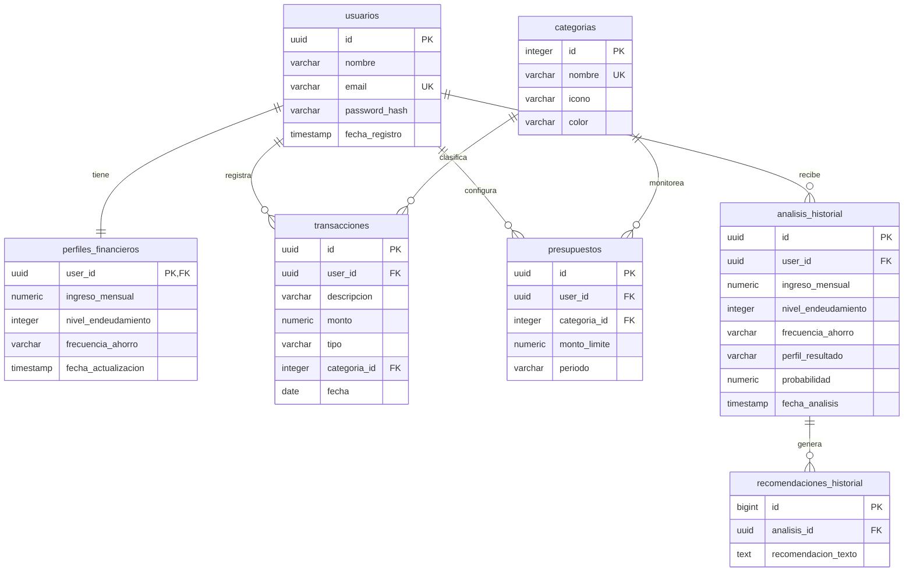

# 🗄️ Diseño y Normalización de la Base de Datos - Finance AI

Este documento detalla la estructura, diseño y normalización (hasta la **Tercera Forma Normal - 3NF**) del modelo de datos relacional para **Finance AI**.

A diferencia del modelo inicial propuesto (que sobredimensionaba el sistema al nivel de un Core Banking transaccional con partida doble y llaves de idempotencia), este diseño está centrado en resolver el problema del Hackathon: **análisis de comportamiento financiero, clasificación inteligente de gastos por IA y seguimiento evolutivo**.

---

## 🏛️ Proceso de Normalización (1NF, 2NF, 3NF)

Para asegurar la integridad de los datos, evitar anomalías de inserción/actualización/borrado y optimizar las consultas del Dashboard en OCI, el esquema original fue normalizado:

### 1. Primera Forma Normal (1NF)
*   **Requisito:** Todos los atributos deben contener valores atómicos (indivisibles). No se permiten grupos repetitivos ni colecciones de datos dentro de una celda.
*   **Aplicación:**
    *   En lugar de almacenar las transacciones como un texto plano o JSON agrupado por usuario, se desglosan en filas individuales en la tabla `transacciones`.
    *   Las sugerencias de ahorro no se guardan como un arreglo de texto JSON dentro de la tabla de análisis, sino en una tabla relacionada uno a muchos llamada `recomendaciones_historial`.

### 2. Segunda Forma Normal (2NF)
*   **Requisito:** Cumplir con la 1NF y garantizar que todos los atributos que no forman parte de la clave primaria dependan por completo de la clave primaria (sin dependencias parciales).
*   **Aplicación:**
    *   Dado que todas nuestras tablas utilizan identificadores únicos surrogate simples (`id` auto-incremental o UUID) como clave primaria, no existen claves primarias compuestas. Por lo tanto, no hay dependencias parciales y el esquema cumple de forma natural con la 2NF.

### 3. Tercera Forma Normal (3NF)
*   **Requisito:** Cumplir con la 2NF y eliminar cualquier dependencia transitiva (ningún atributo que no sea clave debe depender de otro atributo no clave).
*   **Aplicación:**
    *   **Categorías de Gastos:** Si guardamos el nombre de la categoría, su icono y su color dentro de la tabla `transacciones`, el icono y el color dependerían del nombre de la categoría (que no es clave primaria). Para evitar esto, creamos la tabla independiente `categorias` y colocamos una clave foránea (`categoria_id`) en `transacciones`.
    *   **Límites de Presupuesto:** La regla de negocio exige evaluar límites mensuales configurados por el usuario para cada categoría. Guardar estos límites directamente en la tabla de categorías violaría la 3NF ya que los límites dependen del usuario que los define, no de la categoría de forma genérica. Por lo tanto, se separa en una tabla intermedia `presupuestos`.

---

## 📸 Preservación de Estado Histórico (Snapshotting)
Para cumplir con el requerimiento de *"Realizar un seguimiento de la evolución del comportamiento financiero a lo largo del tiempo"*, el sistema debe ser auditable. Si un usuario cambia su ingreso mensual de $4500 a $6000 en el Onboarding/Ajustes, los reportes de análisis pasados de meses anteriores no deben recalcularse dinámicamente con el nuevo valor.
Por ello, la tabla `analisis_historial` actúa como un **Snapshot** que guarda los parámetros financieros (`ingreso_mensual`, `nivel_endeudamiento`, `frecuencia_ahorro`) en el momento exacto en que se ejecutó el análisis.

---

## 📊 Descripción del Diccionario de Datos

El sistema consta de las siguientes tablas:

### 1. Tabla: `usuarios`
Almacena los datos de registro y credenciales del usuario.
*   `id` (UUID, Primary Key): Identificador único del usuario.
*   `nombre` (VARCHAR): Nombre completo.
*   `email` (VARCHAR, UNIQUE): Correo electrónico (índice único para login).
*   `password_hash` (VARCHAR): Contraseña encriptada.
*   `fecha_registro` (TIMESTAMP): Fecha y hora del registro.

### 2. Tabla: `perfiles_financieros`
Almacena las variables de contexto económico declaradas durante el Onboarding o actualizadas en los Ajustes.
*   `user_id` (UUID, Primary Key, Foreign Key ➔ `usuarios.id`): Enlace 1:1 con el usuario.
*   `ingreso_mensual` (NUMERIC): Ingreso neto actual del usuario.
*   `nivel_endeudamiento` (INTEGER): Porcentaje de ingresos destinado a deudas (0-100).
*   `frecuencia_ahorro` (VARCHAR): Frecuencia declarada (Baja, Media, Alta).
*   `fecha_actualizacion` (TIMESTAMP): Última vez que se modificó.

### 3. Tabla: `categorias`
Catálogo de categorías disponibles para clasificar gastos.
*   `id` (INTEGER, Primary Key): Identificador de la categoría.
*   `nombre` (VARCHAR, UNIQUE): Ej: Alimentación, Transporte, Ocio, Servicios, Vivienda, Salud, Educación.
*   `icono` (VARCHAR): Representación visual (icono CSS o SVG).
*   `color` (VARCHAR): Código hexadecimal del tema visual.

### 4. Tabla: `presupuestos`
Límites de gastos configurados por el usuario para alertas del 80% y 100%.
*   `id` (UUID, Primary Key): Identificador único del presupuesto.
*   `user_id` (UUID, Foreign Key ➔ `usuarios.id`): Usuario que define el presupuesto.
*   `categoria_id` (INTEGER, Foreign Key ➔ `categorias.id`): Categoría del límite.
*   `monto_limite` (NUMERIC): Límite mensual (ej: $500).
*   `periodo` (VARCHAR): Período mensual (ej: "2026-07").

### 5. Tabla: `transacciones`
Registra los egresos e ingresos del usuario clasificados automáticamente.
*   `id` (UUID, Primary Key): Identificador de la transacción.
*   `user_id` (UUID, Foreign Key ➔ `usuarios.id`): Usuario dueño de la transacción.
*   `descripcion` (VARCHAR): Detalle textual (ej: "Supermercado").
*   `monto` (NUMERIC): Valor monetario de la transacción.
*   `tipo` (VARCHAR): Tipo de movimiento ('Ingreso' o 'Egreso').
*   `categoria_id` (INTEGER, Foreign Key ➔ `categorias.id`): Categoría asignada.
*   `fecha` (DATE): Fecha de realización de la transacción.

### 6. Tabla: `analisis_historial`
Almacena el registro histórico del perfil de salud financiera generado por el motor de IA para graficar la evolución.
*   `id` (UUID, Primary Key): Identificador del reporte.
*   `user_id` (UUID, Foreign Key ➔ `usuarios.id`): Enlace al usuario.
*   `ingreso_mensual` (NUMERIC): Histórico de ingresos al momento del análisis.
*   `nivel_endeudamiento` (INTEGER): Histórico de deuda al momento del análisis.
*   `frecuencia_ahorro` (VARCHAR): Histórica frecuencia al momento del análisis.
*   `perfil_resultado` (VARCHAR): Diagnóstico ('Saludable', 'En observación', 'En riesgo').
*   `probabilidad` (NUMERIC): Nivel de precisión del modelo ML.
*   `fecha_analisis` (TIMESTAMP): Fecha en que se corrió el análisis.

### 7. Tabla: `recomendaciones_historial`
Desglosa los consejos y planes de acción específicos vinculados a un reporte de análisis.
*   `id` (BIGINT, Primary Key): Autoincremental.
*   `analisis_id` (UUID, Foreign Key ➔ `analisis_historial.id` ON DELETE CASCADE): Enlace al reporte padre.
*   `recomendacion_texto` (TEXT): El consejo específico de IA.

---

## 📐 Diagrama Entidad-Relación (Mermaid)

