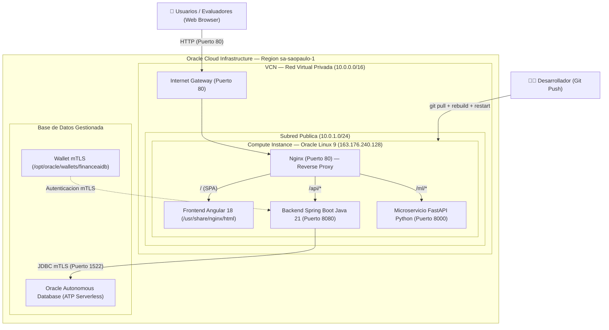

# Finance AI — Arquitectura Cloud & Despliegue en Oracle Cloud (OCI)

Guía técnica de infraestructura, arquitectura de microservicios y despliegue en **Oracle Cloud Infrastructure (OCI)** para la solución **Finance AI**.

---

## 1. Diagrama General de Arquitectura en OCI



---

## 2. Componentes del Despliegue

| Componente | Rol / Tecnología | Puerto Interno | Ruta Pública Nginx | Gestión en Servidor |
| :--- | :--- | :---: | :---: | :--- |
| **Frontend Web** | Angular 18 SPA, TypeScript | — | `/` | Servido por Nginx |
| **Backend Core** | Java 21, Spring Boot 3, JPA Hibernate | `8080` | `/api/*` | Systemd (`fintech.service`) |
| **Microservicio ML** | Python 3.12, FastAPI, Scikit-learn | `8000` | `/ml/*` | Proceso daemon Uvicorn |
| **Base de Datos** | Oracle Autonomous DB (ATP 19c) | `1522` | No expuesta directa | Gestionada por OCI (mTLS) |
| **Reverse Proxy** | Nginx con soporte SELinux | `80` | Gateway Unificado | Systemd (`nginx.service`) |

---

## 3. Topología de Red y Seguridad

> [!NOTE]
> **Gateway Unificado (Puerto 80):** Toda la comunicación externa entra exclusivamente por el puerto HTTP 80 gestionado por Nginx. Los servicios backend e IA corren en la red interna local (`127.0.0.1`), protegiendo los puertos `8080` y `8000` del acceso público directo.

1. **Cifrado de Base de Datos (mTLS):** Conexión segura con Oracle ATP mediante Wallet criptográfico almacenado en `/opt/oracle/wallets/financeaidb` (`cwallet.sso`, `tnsnames.ora`, `ojdbc.properties`).
2. **SELinux:** Configurado con la directiva `httpd_can_network_connect = 1` para permitir el puente de red entre Nginx y los microservicios locales.
3. **Firewall del Sistema (firewalld):** Puertos `80/tcp` (HTTP) y `22/tcp` (SSH) habilitados de forma permanente.

---

## 4. Comandos de Gestión y Monitoreo en Producción

### 4.1 Backend Java (Spring Boot)
El backend está registrado como servicio `systemd` para arranque automático y recuperación ante caídas:

```bash
# Ver estado del servicio
sudo systemctl status fintech --no-pager

# Reiniciar / Detener / Iniciar
sudo systemctl restart fintech
sudo systemctl stop fintech
sudo systemctl start fintech

# Ver logs en tiempo real
sudo journalctl -u fintech -f
```

### 4.2 Microservicio de Inteligencia Artificial (FastAPI)
```bash
# Verificar que el servicio este respondiendo (retorna 200 OK)
curl -s -o /dev/null -w "%{http_code}\n" http://localhost:8000/docs

# Reiniciar microservicio si es necesario
cd ~/g9-latam-team-05/finance-ai-ml
source venv/bin/activate
nohup uvicorn main:app --host 0.0.0.0 --port 8000 > /tmp/fastapi.log 2>&1 &
```

### 4.3 Servidor Web Nginx
```bash
# Validar sintaxis de configuracion
sudo nginx -t

# Recargar configuracion sin interrumpir servicio
sudo systemctl reload nginx

# Ver logs de error
sudo tail -f /var/log/nginx/error.log
```

---

## 5. Flujo de Trabajo para Publicar Cambios (CI/CD Manual)

Cuando se realicen ajustes en el código local y se haga `git push`, seguir estos pasos en la máquina virtual:

```bash
# 1. Conectarse a la instancia y actualizar repositorio
ssh -i /ruta/tu-llave.key opc@163.176.240.128
cd ~/g9-latam-team-05
git pull origin RamaEdison

# 2. Si se modifico el Frontend Angular:
cd ~/g9-latam-team-05/frontend
npm run build
sudo cp -r dist/finance-ai/browser/* /usr/share/nginx/html/
sudo systemctl reload nginx

# 3. Si se modifico el Backend Java:
cd ~/g9-latam-team-05/backend
./mvnw clean package -DskipTests
sudo systemctl restart fintech

# 4. Si se modifico el Modelo Python ML:
cd ~/g9-latam-team-05/finance-ai-ml
source venv/bin/activate
python train_model.py
pkill uvicorn
nohup uvicorn main:app --host 0.0.0.0 --port 8000 > /tmp/fastapi.log 2>&1 &
```

---

## 6. Accesos y Credenciales de Demostración

* **URL de la Aplicación Web:** `http://163.176.240.128/`
* **Swagger UI (Backend API):** `http://163.176.240.128/api/swagger-ui/index.html`
* **Documentación FastAPI ML:** `http://163.176.240.128/ml/docs`

### Credenciales Sembradas por el Sistema:
* **Usuario:** `carlos.mendoza@nocountry.com`
* **Contraseña:** `CarlosPass123!`
