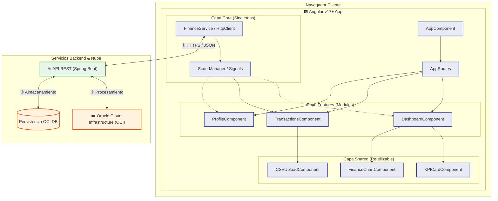
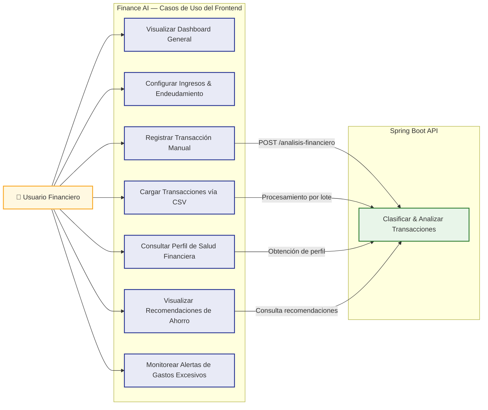
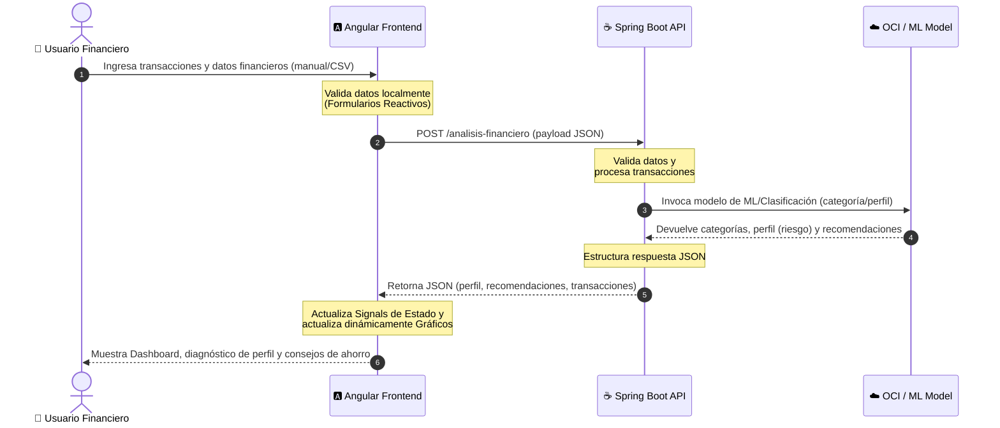

# 🅰️ Documentación de Frontend - Finance AI

¡Bienvenido a la documentación del frontend de **Finance AI**! Esta aplicación ha sido diseñada y planificada como parte del **Hackathon ONE – Proyectos G9 | Alura + Oracle**.

El objetivo principal de la interfaz es proporcionar al usuario una experiencia premium, interactiva e inteligente para monitorear su salud financiera, clasificar sus gastos de forma automatizada (mediante modelos de Machine Learning y APIs) y recibir recomendaciones personalizadas de ahorro.

---

## 🚀 Arquitectura del Frontend

La aplicación utiliza **Angular Moderno (v17/v18/v19+)** implementando los patrones más recientes y eficientes recomendados por la comunidad:

*   **Arquitectura Standalone:** Eliminación de los módulos tradicionales (`NgModule`) en favor de componentes auto-contenidos, reduciendo el boilerplate y optimizando la carga.
*   **Signals para la Gestión del Estado:** Uso de `signal()`, `computed()` y `effect()` para controlar el estado local e interactuar con el backend de manera reactiva, rápida y sin suscripciones complejas.
*   **Lazy Loading:** Carga bajo demanda de todas las pantallas/vistas a través del sistema de enrutamiento nativo (`app.routes.ts`) para optimizar el rendimiento de la aplicación.
*   **CSS / SCSS Puro (Vanilla CSS):** Diseño de interfaces moderno y premium con variables CSS para el control de paletas de color oscuras, gradientes suaves y animaciones de interacción (micro-interactions).

### 📁 Estructura del Código Fuente (`src/app/`)

Siguiendo una arquitectura orientada a características (*Feature-Oriented*), el proyecto se divide de la siguiente manera:

```text
src/app/
├── core/                         # Recursos compartidos y configuraciones singleton
│   ├── services/                 # Servicios globales (ej: finance.service.ts para API REST)
│   ├── guards/                   # Protectores de rutas (ej: auth.guard.ts)
│   └── interceptors/             # Interceptores de HttpClient (ej: error.interceptor.ts)
├── shared/                       # Componentes visuales genéricos y utilidades
│   ├── components/               # Botones, tarjetas de KPI, spinners de carga
│   ├── pipes/                    # Formateadores (moneda, fechas, etc.)
│   └── directives/               # Comportamientos interactivos adicionales
├── features/                     # Componentes y lógica de negocio por dominio
│   ├── dashboard/                # Panel principal, visualización de métricas y gráficos
│   ├── transactions/             # Tabla de transacciones, formulario y carga CSV
│   └── profile/                  # Perfil de salud financiera y sugerencias de IA
├── app.config.ts                 # Configuración de proveedores globales (HttpClient, Routing)
├── app.routes.ts                 # Definición de rutas del sistema
└── app.component.ts              # Componente principal contenedor
```

---

## 📐 Diagramas del Sistema

A continuación se presentan los diagramas que detallan la organización y flujo de interacción de Finance AI:

### 1. Arquitectura de Componentes
Muestra las capas internas del frontend y su conexión con el backend en Spring Boot y los servicios en OCI.



### 2. Diagrama de Casos de Uso
Define las interacciones del usuario final con las capacidades implementadas en la interfaz de la aplicación:



### 3. Diagrama de Secuencia de Análisis
Describe el ciclo de vida de una solicitud de análisis financiero enviada por el usuario desde la interfaz web:



---

## 🛠️ Casos de Uso del Cliente (Frontend)

### CU-01: Configuración de Datos Iniciales e Ingresos
*   **Descripción:** El usuario configura su perfil económico base (ingreso mensual, nivel de endeudamiento inicial, y frecuencia de ahorro estimada).
*   **Flujo del Frontend:**
    1. El usuario completa los campos numéricos en la interfaz del panel lateral.
    2. El frontend valida que sean valores numéricos coherentes (ej. ingresos mayores a cero).
    3. El estado de la aplicación actualiza los `Signals` correspondientes y los expone al resto de componentes.

### CU-02: Registro Manual y Clasificación Automática de Gastos
*   **Descripción:** El usuario registra un nuevo gasto describiendo brevemente en qué consistió (ej. "Combustible para el auto").
*   **Flujo del Frontend:**
    1. Se ingresa la descripción y monto del gasto en el formulario reactivo tipado.
    2. Al hacer clic en "Añadir", el frontend solicita al backend la clasificación.
    3. Al retornar la respuesta del backend (ej. categoría "Transporte"), se añade a la tabla principal con su color e icono representativos y se actualizan los gráficos de pastel del Dashboard de manera instantánea.

### CU-03: Carga de Transacciones por Lotes (CSV)
*   **Descripción:** El usuario sube un extracto bancario en formato CSV para un procesamiento a gran escala.
*   **Flujo del Frontend:**
    1. El componente `CSVUploadComponent` lee el archivo arrastrado o seleccionado por el usuario.
    2. Analiza el formato y lo convierte en una colección de transacciones.
    3. Realiza un envío único al backend y despliega una barra de progreso.
    4. Al finalizar la respuesta, actualiza el estado global con las clasificaciones devueltas y notifica el éxito mediante un modal animado.

### CU-04: Consulta de Diagnóstico Financiero y Planes de Acción
*   **Descripción:** La interfaz presenta el dictamen sobre la salud financiera del usuario y los consejos correspondientes.
*   **Flujo del Frontend:**
    1. Se calcula o recupera el perfil financiero del usuario (`Saludable`, `En observación`, `En riesgo`).
    2. Se renderiza una tarjeta con un color temático según el nivel de riesgo:
        *   **Saludable (Verde Esmeralda):** Indicadores estables, mensajes motivacionales.
        *   **En observación (Amarillo Ámbar):** Consejos de prevención.
        *   **En riesgo (Rojo Coral):** Alertas urgentes y planes de acción recomendados por la inteligencia de negocio.

---

## 🔌 Integración de la API (Contrato de Datos)

El servicio `FinanceService` (`core/services/finance.service.ts`) consume el endpoint REST del backend:

### Endpoint: `POST /analisis-financiero`

#### Estructura de Entrada (Petición)
```json
{
  "ingreso_mensual": 4500,
  "nivel_endeudamiento": 25,
  "frecuencia_ahorro": "Media",
  "transacciones": [
    {
      "descripcion": "Supermercado",
      "valor": 420
    },
    {
      "descripcion": "Combustible",
      "valor": 300
    },
    {
      "descripcion": "Streaming",
      "valor": 40
    }
  ]
}
```

#### Estructura de Salida (Respuesta)
```json
{
  "perfil_financiero": "En observación",
  "probabilidad": 0.82,
  "resumen_gastos": {
    "alimentacion": 420,
    "transporte": 300,
    "entretenimiento": 40
  },
  "recomendaciones": [
    "Monitorear los gastos recurrentes de entretenimiento",
    "Aumentar la reserva financiera mensual"
  ]
}
```

---

## 🎨 Lineamientos de Diseño Visual (Premium)

1.  **Esquema de Colores (Modo Oscuro Predeterminado):**
    *   Fondo de Pantalla: Azul Grisáceo Profundo (`#0F172A`)
    *   Tarjetas y Paneles: Vidrio/Glassmorphism (`rgba(30, 41, 59, 0.7)`) con efecto blur y bordes finos.
    *   Acentos: Gradientes lineales (Violeta a Azul Neón) para botones e indicadores clave.
2.  **Tipografía:**
    *   Uso de fuentes optimizadas de Google Fonts: `Inter` para cuerpo y tablas de datos; `Outfit` o `Plus Jakarta Sans` para titulares y KPIs.
3.  **Transiciones y Micro-animaciones:**
    *   Los gráficos e indicadores deben cargar con una transición suave.
    *   Los botones e items de transacciones tendrán efectos al pasar el cursor (hover) escalando ligeramente (`scale(1.02)`) con una transición de `0.2s cubic-bezier(0.4, 0, 0.2, 1)`.


Qué es lo que busca hacer este sistema? (El Core del Negocio)
Imagina una aplicación como Splitwise, Fintonic o la sección de finanzas de tu app bancaria, pero potenciada con Inteligencia Artificial.

El usuario promedio tiene un montón de transacciones (ej: "Uber", "Netflix", "Coto", "Luz") pero no tiene tiempo de clasificarlas ni sabe si está gastando de más. El sistema busca:

Clasificar automáticamente cada gasto en categorías claras (Alimentación, Transporte, Salud, Ocio, etc.).
Evaluar al usuario para decirle: "Tu perfil financiero está En Observación porque tu endeudamiento es alto" o "Estás en Riesgo porque gastas más de lo que ganas".
Darle recomendaciones personalizadas y automáticas para mejorar (ej: "Reduce un 10% tus gastos de Ocio").
🎨 ¿Qué se pide exactamente en el Frontend? (La Interfaz del Sistema)
El frontend en Angular no es un simple formulario de registro; debe ser un Simulador e Historial de Salud Financiera. Para cumplir con el MVP y destacar en el Hackathon, el Frontend debe estructurarse en 3 secciones o componentes clave:

1. Panel de Contexto del Usuario (Simulador de Perfil)
Qué hace: Permite al usuario declarar su situación financiera base.
Inputs del usuario:
Ingreso mensual (ej: $4500)
Nivel de endeudamiento actual en % (ej: 25%)
Frecuencia de ahorro (Baja, Media, Alta)
Por qué va más allá: Al cambiar estos valores, el sistema debe recalcular dinámicamente el perfil del usuario (Saludable, En observación, En riesgo) y actualizar los consejos en pantalla en tiempo real.
2. Consola de Transacciones (Manual y Carga Masiva)
Entrada de transacciones:
El usuario escribe la descripción (ej: "Cena con amigos") y el valor (ej: $80).
Carga de CSV (Lotes): El usuario arrastra un archivo de Excel/CSV con 50 transacciones.
Categorización automática visual: Cuando el usuario envía la transacción, el frontend hace la llamada a la API y la transacción aparece en la tabla con un icono y color automático según la categoría que predijo el modelo (ej: 🍕 Alimentación, 🚗 Transporte, 🎬 Ocio).
3. Dashboard Visual de Salud Financiera (La joya del frontend)
Gráficos dinámicos (Chart.js):
Un gráfico de dona/pastel que muestra el porcentaje real de en qué se va el dinero (ej: 40% en vivienda, 20% en ocio).
Un gráfico de líneas o barras que muestre el seguimiento del comportamiento a lo largo del tiempo (cómo cambiaron sus gastos el mes pasado vs este mes).
Semáforo de Perfil: Un banner llamativo que indique el perfil financiero actual con un color representativo:
🟢 Saludable: (Si el endeudamiento es bajo y la capacidad de ahorro es alta).
🟡 En Observación: (Si hay gastos altos en ocio o ahorro medio).
🔴 En Riesgo: (Si el nivel de deuda supera el 50% o los gastos superan el ingreso).
Tarjetas de Recomendaciones: Cuadros visuales interactivos con consejos para el usuario (ej: "Alerta: Tus gastos de Ocio superan el 15% recomendado. Intenta reducirlos").
🔗 ¿Cómo se conecta todo? (El Flujo Técnico)
Para que el frontend funcione, se conecta en cadena de esta manera:

mermaid
graph LR
    Usuario["👤 Usuario"] -->|"1. Ingresa datos / CSV"| Angular["🅰️ Frontend (Angular)"]
    Angular -->|"2. Envía JSON a la API"| Spring["☕ Backend (Spring Boot)"]
    Spring -->|"3. Solicita Predicción"| Python["🐍 Modelos ML (FastAPI)"]
    Python -->|"4. Categoría y Diagnóstico"| Spring
    Spring -->|"5. Guarda en Base de Datos"| OCI["☁️ Base de Datos & Storage (OCI)"]
    Spring -->|"6. Retorna Respuesta JSON"| Angular
    Angular -->|"7. Renderiza gráficos e indicadores"| Usuario
El Frontend (Angular) recolecta todo y envía un único objeto JSON al backend mediante un POST /analisis-financiero.
El Backend (Java Spring Boot) recibe esta información, valida los datos y la envía al microservicio de Python.
El Microservicio de Python (Ciencia de Datos) procesa los textos de las transacciones, predice las categorías con el modelo entrenado de Machine Learning, determina el perfil de riesgo y la probabilidad del perfil.
El Backend (Java) guarda el historial en la base de datos de Oracle Cloud (OCI) y responde un JSON estructurado con la clasificación y recomendaciones.
El Frontend (Angular) lee esa respuesta, actualiza las Signals reactivas y dibuja automáticamente los gráficos y las tarjetas de recomendaciones.
¿Qué hacemos ahora con la documentación de Word?
Ya que comprendemos esto, he preparado el documento de Word para que cubra exactamente este enfoque académico y de negocios (las pantallas del front, cómo procesa el CSV, cómo se integran las APIs con Java y Python, y el despliegue en OCI).

¿Te gustaría que añadamos algo más específico al documento de Word o prefieres que revisemos el código de la estructura para cuando estés listo para programarlo?