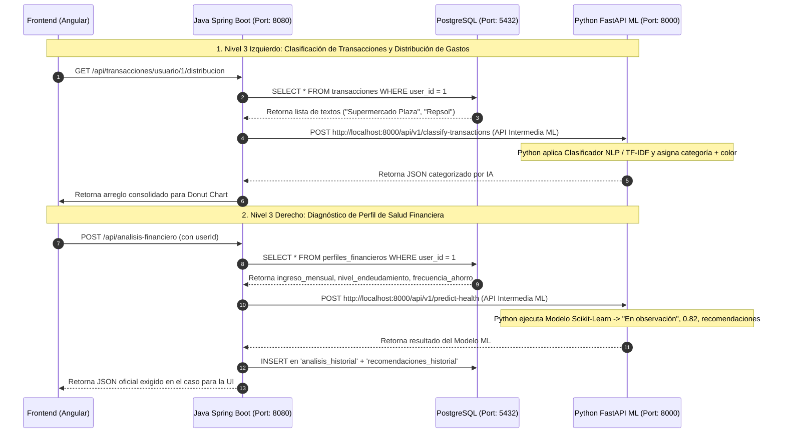

# 🖥️ Especificación del Flujo Trilateral de Datos (Frontend ➔ Java ➔ Python FastAPI ➔ PostgreSQL)

Este documento detalla **el viaje completo y exacto de los datos** para cada componente del **Dashboard General**, indicando los JSONs de entrada, los endpoints intermedios consumidos entre Java y el Microservicio de Python (FastAPI / IA), la persistencia en PostgreSQL y la respuesta final devuelta al Frontend.

---

## 🗺️ Visión de la Arquitectura de Microservicios e Intermediarios



---

## 🔐 PANTALLA 0: AUTENTICACIÓN (LOGIN Y REGISTRO)

### 🟢 0.1 Login (`POST /api/usuarios/login`)
1. **Frontend envía a Java (`POST /api/usuarios/login`):**
   ```json
   { "email": "demo@nocountry.com", "password": "Password123!" }
   ```
2. **Java procesa:** Consulta `usuarios` en PostgreSQL, verifica clave hash BCrypt, genera Token JWT.
3. **Java responde a Frontend (200 OK):**
   ```json
   {
     "token": "eyJhbGciOiJIUzI1NiJ9...",
     "usuario": { "id": 1, "nombre": "Demo Usuario", "email": "demo@nocountry.com" }
   }
   ```
4. **📌 Memoria Frontend:** Frontend guarda `usuario.nombre` en `LocalStorage`. **No requiere ninguna llamada a la red para pintar el Header.**

---

## 🖥️ PANTALLA 1: DASHBOARD GENERAL (Flujo Completo por Componente)

---

### 🟢 NIVEL 1: Header / Navbar Superior (Arriba)
*   **Elementos UI:** Badge `SALUDABLE`, Avatar `U` y `Demo Usuario`.
*   **Petición HTTP:** ⚡ **CERO LLAMADAS A LA RED.** Lee directamente de `LocalStorage`.

---

### 🟢 NIVEL 2: Fila de Tarjetas Resumen (KPI Cards)
*   **Elementos UI:** `INGRESOS MENSUALES` ($4,500), `GASTOS TOTALES` ($2,470), `BALANCE NETO` ($2,030), `TASA DE AHORRO` (45%).
*   **Flujo de Datos Paso a Paso (Agnóstico de Base de Datos - Spring Data JPA):**
    1. **Frontend envía a Java:** `GET /api/dashboard/resumen/1`
    2. **Java (Spring Boot) consulta via Repositorios JPA (Agnóstico PostgreSQL / Oracle):**
       - Java invoca `perfilFinancieroRepository.findByUsuarioId(1)` para obtener el `ingresoMensual` ($4,500.00).
       - Java invoca `transaccionRepository.findByUsuarioIdAndTipo(1, TipoTransaccion.GASTO)` para sumar el acumulado de egresos ($2,470.00).
    3. **Java calcula aritméticamente en servicio:**
       - `balanceNeto = ingresosMensuales - gastosTotales` ($4,500.00 - $2,470.00 = $2,030.00)
       - `tasaAhorro = (balanceNeto / ingresosMensuales) * 100` (45.11%)
    4. **Microservicio Python:** `N/A` *(No se requiere inferencia de IA para este cálculo aritmético estándar)*.
    5. **Java responde a Frontend (200 OK):**
       ```json
       {
         "ingresosMensuales": 4500.00,
         "gastosTotales": 2470.00,
         "balanceNeto": 2030.00,
         "tasaAhorro": 45.11
       }
       ```

---


### 🟢 NIVEL 3 (PANEL IZQUIERDO): `Distribución de Gastos` (Donut Chart)

#### 🎨 Elementos UI que Pinta el Frontend:
Gráfico Donut de `Chart.js` dividiendo el consumo por categorías (`Alimentación`, `Transporte`, `Ocio`, `Vivienda`, `Salud`, `Servicios`, `Educación`).

#### 🔄 Flujo Completo Trilateral con Python (FastAPI):

1. **Frontend envía a Java Backend:**
   * **Endpoint:** `GET /api/transacciones/usuario/1/distribucion`

2. **Java consulta a PostgreSQL:**
   * Obtiene la lista de transacciones sin clasificar o pendientes del usuario.
   ```json
   [
     { "id": 15, "descripcion": "Supermercado Plaza", "monto": 420.00 },
     { "id": 16, "descripcion": "Gasolinera Repsol", "monto": 300.00 }
   ]
   ```

3. **Java consume la API Intermedia de Python FastAPI (IA / ML):**
   * **Endpoint Intermedio Python:** `POST http://localhost:8000/api/v1/classify-transactions`
   * **Payload que Java envía a Python:**
     ```json
     {
       "transacciones": [
         { "id": 15, "text": "Supermercado Plaza", "monto": 420.00 },
         { "id": 16, "text": "Gasolinera Repsol", "monto": 300.00 }
       ]
     }
     ```

4. **Python FastAPI procesa la Clasificación ML (NLP / Scikit-Learn):**
   * Pasa el texto de las descripciones (`"Supermercado Plaza"`) por el modelo ML.
   * **Principio de Desacoplamiento:** Python **NO** se conecta a la Base de Datos. Devuelve únicamente el nombre predicho de la categoría:
   * **Python responde a Java Backend (200 OK):**
     ```json
     {
       "clasificados": [
         { "id": 15, "categoriaPredicha": "Alimentación", "monto": 420.00 },
         { "id": 16, "categoriaPredicha": "Transporte", "monto": 300.00 }
       ]
     }
     ```

5. **Java empareja o AUTO-REGISTRA la Categoría en BD y persiste:**
   * Java recibe el texto (ej: `"Alimentación"` o una nueva como `"Mascotas"`).
   * Java busca en BD: `categoriaRepository.findByNombre(categoriaPredicha)`.
   * **SI EXISTE:** Recupera su `id`, `color` e `icono`.
   * **SI NO EXISTE (Categoría Nueva Detectada por IA):** Java **CREA Y REGISTRA DINÁMICAMENTE** la nueva categoría en la tabla `categorias` (con color por defecto `#6C757D` e icono `"tag"`) ejecutando `categoriaRepository.save(nuevaCat)`.
   * Java asigna el `categoria_id` resultante a la transacción y guarda en la tabla `transacciones`.

6. **Java calcula la distribución porcentual y responde al Frontend (200 OK):**
   ```json
   [
     { "categoria": "Alimentación", "montoTotal": 850.00, "porcentaje": 34.41, "color": "#3357FF", "icono": "shopping-cart" },
     { "categoria": "Transporte", "montoTotal": 320.00, "porcentaje": 12.95, "color": "#28A745", "icono": "bus" },
     { "categoria": "Ocio", "montoTotal": 200.00, "porcentaje": 8.09, "color": "#00BCD4", "icono": "film" },
     { "categoria": "Vivienda", "montoTotal": 700.00, "porcentaje": 28.34, "color": "#FFC107", "icono": "home" }
   ]
   ```

---


### 🟢 NIVEL 3 (PANEL DERECHO): `Diagnóstico de Perfil` (EL CORAZÓN DEL PROYECTO - MVP OBLIGATORIO)

Esta es la funcionalidad central y punto crítico exigido en las reglas oficiales del Hackathon **Alura + Oracle (`caso`)**. Integra el modelo de Inteligencia Artificial de Python con el Orquestador Java y la persistencia de historial.

#### 🎨 Elementos UI que Pinta el Frontend:
- Badge de Salud Financiera: `• En observación` (Verde, Amarillo o Rojo según el perfil).
- Probabilidad de predicción de la IA: `82%` (`probabilidad * 100`).
- Lista de Recomendaciones de IA: *"Monitorear los gastos recurrentes de entretenimiento"*, *"Aumentar la reserva financiera mensual"*.

#### 🔄 Flujo Completo Trilateral del Endpoint Corazón (`POST /api/analisis-financiero`):

1. **Frontend envía a Java Backend (Cubre los 2 Casos de Uso):**
   * **Endpoint:** `POST /api/analisis-financiero`
   
   * **🧪 CASO A (Modo Evaluador Jueces / Postman / Caso Oficial):**
     *Envía transacciones escritas a mano para prueba rápida sin BD:*
     ```json
     {
       "ingreso_mensual": 4500.00,
       "nivel_endeudamiento": 25.00,
       "frecuencia_ahorro": "Media",
       "transacciones": [
         { "descripcion": "Supermercado", "valor": 420.00 },
         { "descripcion": "Combustible", "valor": 300.00 },
         { "descripcion": "Streaming", "valor": 40.00 }
       ]
     }
     ```
   
   * **🚀 CASO B (Modo Producción App Real Angular):**
     *Envía únicamente el identificador del usuario logueado para que Java auto-complete desde la BD:*
     ```json
     {
       "userId": 1,
       "mes": 7,
       "anio": 2026
     }
     ```

2. **Java Orquestador (Spring Boot) ejecuta el Patrón Híbrido Inteligente:**
   * Java evalúa si la petición proviene de un evaluador del Hackathon o de la app real:
     - **🧪 MODO EVALUADOR JUECES (Postman):** Si el JSON incluye `transacciones`, Java toma ese arreglo directamente.
     - **🚀 MODO PRODUCCIÓN (Angular):** Si no viene `transacciones` (o solo viene `userId`), Java consulta la BD via JPA (`transaccionRepository.findByUsuarioIdAndMes(userId, mesActual)`).
   * Java valida que no existan nulos ni valores negativos.
   * Java realiza la llamada HTTP interna al microservicio de Data Science:
   * **Endpoint Interno:** `POST http://localhost:8000/api/v1/predict-health`
   * **Payload enviado a Python (Java ➔ Python):**
     ```json
     {
       "ingreso_mensual": 4500.00,
       "nivel_endeudamiento": 25.00,
       "frecuencia_ahorro": "Media",
       "transacciones": [
         { "descripcion": "Supermercado", "valor": 420.00 },
         { "descripcion": "Combustible", "valor": 300.00 },
         { "descripcion": "Streaming", "valor": 40.00 }
       ]
     }
     ```

3. **Python FastAPI (Ciencia de Datos / ML) ejecuta la inferencia:**
   * **Clasificación NLP de Transacciones:** Clasifica `"Supermercado"` ➔ `alimentacion`, `"Combustible"` ➔ `transporte`, `"Streaming"` ➔ `entretenimiento`.
   * **Agrupación `resumen_gastos`:** Suma los montos por categoría (`alimentacion: 420`, `transporte: 300`, `entretenimiento: 40`).
   * **Inferencia de Perfil ML (Scikit-Learn):** Evalúa el vector de características en el modelo `.joblib` entrenado ➔ Perfil: `"En observación"`, Probabilidad: `0.82`.
   * **Generación de Recomendaciones:** Selecciona las frases de recomendación personalizadas.
   * **Python responde a Java (Response Payload 200 OK):**
     ```json
     {
       "perfil_financiero": "En observación",
       "probabilidad": 0.82,
       "resumen_gastos": {
         "alimentacion": 420.00,
         "transporte": 300.00,
         "entretenimiento": 40.00
       },
       "recomendaciones": [
         "Monitorear los gastos recurrentes de entretenimiento",
         "Aumentar la reserva financiera mensual"
       ]
     }
     ```

4. **Java realiza la Persistencia del Snapshot Histórico en BD (PostgreSQL/Oracle):**
   * Java inserta una fila de auditoría en `analisis_historial` (`ingreso_mensual`, `nivel_endeudamiento`, `frecuencia_ahorro`, `perfil_resultado = 'En observación'`, `probabilidad = 0.82`).
   * Java inserta las filas en `recomendaciones_historial` asociadas al `analisis_historial_id`.

5. **Java responde al Frontend (Response Body Oficial del Caso - 200 OK):**
   ```json
   {
     "perfil_financiero": "En observación",
     "probabilidad": 0.82,
     "resumen_gastos": {
       "alimentacion": 420.00,
       "transporte": 300.00,
       "entretenimiento": 40.00
     },
     "recomendaciones": [
       "Monitorear los gastos recurrentes de entretenimiento",
       "Aumentar la reserva financiera mensual"
     ]
   }
   ```

---

### 🟢 NIVEL 4: Sección Inferior (`Transacciones Recientes`)

#### 🎨 Elementos UI que Pinta el Frontend:
Lista reducida con `Supermercado Plaza` | `2026-07-10` | `Alimentación` | `$420.00`.

#### 🔄 Flujo de Datos (Agnóstico de Base de Datos - Spring Data JPA):
- `balanceNeto = ingresosMensuales - gastosTotales` ($4,500.00 - $2,470.00 = $2,030.00)
       - `tasaAhorro = (balanceNeto / ingresosMensuales) * 100` (45.11%)
    4. **Microservicio Python:** `N/A` *(No se requiere inferencia de IA para este cálculo aritmético estándar)*.
    5. **Java responde a Frontend (200 OK):**
       ```json
       {
         "ingresosMensuales": 4500.00,
         "gastosTotales": 2470.00,
         "balanceNeto": 2030.00,
         "tasaAhorro": 45.11
       }
       ```

---

1. **Frontend envía a Java:** `GET /api/transacciones/usuario/1/recientes?limit=5`
2. **Java (Spring Boot) consulta via Repositorio JPA (Agnóstico PostgreSQL / Oracle):**
   - Invoca `transaccionRepository.findByUsuarioIdOrderByFechaDesc(1, PageRequest.of(0, 5))`.
3. **Microservicio Python:** `N/A` *(Python no influye en este proceso. Es una consulta directa a la BD administrada por Java)*.
4. **Java responde a Frontend (200 OK):**
   ```json
   [
     {
       "id": 15,
       "descripcion": "Supermercado Plaza",
       "fecha": "2026-07-10",
       "categoriaNombre": "Alimentación",
       "monto": 420.00,
       "tipo": "GASTO"
     }
   ]
   ```

---

## 🖥️ PANTALLA 2: PÁGINA DE TRANSACCIONES (Flujo Completo por Componente)

### 🎯 Objetivos de la Pantalla:
1. **Ingreso Manual de Transacciones:** Permitir al usuario registrar transacciones ingresando descripción y valor, asociándolo a una categoría seleccionada o guardándolo como "Sin clasificar" para su posterior procesamiento.
2. **Carga Masiva en Lote:** Procesar masivamente listados de transacciones desde archivos CSV, registrándolas en la base de datos de manera ágil sin latencia de clasificación inmediata.
3. **Auditoría e Historial de Movimientos:** Presentar la lista completa de transacciones con opciones de ordenamiento dinámico y eliminación directa.

> [!NOTE]
> **Estrategia de Clasificación IA Bajo Demanda (Lazy Classification):**
> Para evitar sobrecargar el microservicio de Python y la base de datos con llamadas NLP síncronas en cada registro (Manual o CSV), las nuevas transacciones se guardan directamente en base de datos con la categoría default `"Sin clasificar"` (`categoria_id` apuntando a un registro default).
> La clasificación real mediante IA se ejecuta de manera diferida cuando el usuario vuelve a la **Pantalla 1 (Dashboard)**: al cargarse, el endpoint existente `GET /api/transacciones/usuario/{usuarioId}/distribucion` detecta transacciones pendientes, llama en lote a Python FastAPI para categorizarlas, actualiza la base de datos y recalcula la distribución en una sola operación optimizada. Si no hay pendientes, Java simplemente realiza una agregación SQL local rápida, evitando consumir recursos de red hacia Python.

---

### 🟢 NIVEL 1 (PANEL IZQUIERDO - SUPERIOR): Formulario de Registro Manual (`Añadir Transacción`)
*   **Estado del Endpoint:** 🆕 **[NUEVO ENDPOINT DE ESCRITURA]** (En la Pantalla 1 solo se consultan transacciones, por lo que este endpoint es de nueva creación).
*   **Elementos UI:** Formulario con campos: `Descripción` (input de texto), `Monto ($)` (input numérico), y `Categoría` (selector dropdown con opción por defecto "Clasificación IA").
*   **Flujo de Datos Paso a Paso (Optimizado - Registro Directo):**
    1. **Frontend envía a Java (Dispara petición HTTP):**
       * **Endpoint:** `POST /api/transacciones`
       * **Request Payload (JSON):**
         ```json
         {
           "descripcion": "Supermercado Plaza",
           "monto": 420.00,
           "tipo": "GASTO",
           "categoriaNombre": "" // Vacío para postergar la clasificación por IA, o valor de dropdown explícito
         }
         ```
       *(Nota: El backend extrae la identidad del usuario desde el token JWT en el encabezado `Authorization: Bearer <token>`)*.
    2. **Java Orquestador procesa (Sin llamada a IA inmediata):**
       * Si `categoriaNombre` viene vacío (`""` o `null`), Java asocia la transacción a la categoría default `"Sin clasificar"` (color `#6C757D`, icono `"tag"`). **No se realiza ninguna llamada de red al microservicio de Python FastAPI en este momento.**
       * Si `categoriaNombre` viene con un valor explícito seleccionado por el usuario (ej. `"Transporte"`), Java asocia esa categoría existente de la BD.
    3. **Persistencia:** Java graba el registro en la tabla `transacciones` vinculándolo al usuario y la categoría correspondiente.
    4. **Java responde a Frontend (201 Created):** Retorna la transacción con su ID de BD y la información de la categoría:
       ```json
       {
         "id": 15,
         "userId": 1,
         "categoria": { "id": 10, "nombre": "Sin clasificar", "icono": "tag", "color": "#6C757D" },
         "descripcion": "Supermercado Plaza",
         "monto": 420.00,
         "tipo": "GASTO",
         "fecha": "2026-07-31"
       }
       ```
    5. **Frontend actualiza estado:** Agrega la transacción a la señal de datos `transactions`, actualizando la tabla y los KPIs del dashboard de manera reactiva.

---

### 🟢 NIVEL 2 (PANEL IZQUIERDO - INFERIOR): Importación Masiva en Lote (`Importar Lote (CSV)`)
*   **Estado del Endpoint:** 🆕 **[NUEVO ENDPOINT]** (Procesamiento y creación de transacciones en lote de manera optimizada).
*   **Elementos UI:** Zona de arrastre de archivos (Drag & Drop) y botón de búsqueda de archivos locales que admite archivos `.csv` en formato `descripcion,monto`.
*   **Flujo de Datos Paso a Paso (Optimizado - Registro Directo en Lote):**
    1. **Frontend procesa localmente:** El componente lee el archivo CSV, parsea sus líneas y extrae la lista de descripciones y montos.
    2. **Frontend envía a Java (Dispara petición HTTP):**
       * **Endpoint:** `POST /api/transacciones/lote`
       * **Request Payload (JSON):**
         ```json
         [
           { "descripcion": "Combustible Puma", "monto": 300.00 },
           { "descripcion": "Suscripción Netflix", "monto": 40.00 }
         ]
         ```
    3. **Java procesa y persiste (Sin llamada a IA inmediata):**
       * Java recorre la lista e inserta todos los movimientos vinculándolos a la categoría default `"Sin clasificar"`. **No se realiza ninguna llamada de red al microservicio de Python FastAPI durante el proceso de importación.**
    4. **Java responde a Frontend (201 Created):** Devuelve el listado de transacciones creadas y guardadas en BD, marcadas como `"Sin clasificar"`.
    5. **Frontend actualiza estado:** Concatena las nuevas transacciones a la señal `transactions` para repintar la tabla de manera inmediata y muestra una notificación de éxito al usuario.

---

### 🟢 NIVEL 3 (PANEL DERECHO): Historial de Movimientos (Tabla Interactiva)
*   **Elementos UI:** Tabla completa con columnas ordenables interactiva (`Fecha`, `Descripción`, `Categoría` con badges de color, `Monto`) y botón de acción de borrado.
*   **Flujo de Datos de Consulta Inicial:**
    *   **Estado del Endpoint:** 🔄 **[REUTILIZACIÓN DE ENDPOINT EXISTENTE]**
    *   **Nota de Reutilización:**
        > [!NOTE]
        > Este flujo trabaja directamente sobre el controlador y repositorio ya existentes del backend, reutilizando el endpoint de la **Pantalla 1** (`GET /api/transacciones/usuario/{usuarioId}/recientes`). Sin embargo, en esta pantalla se amplía omitiendo el parámetro query `limit=5` (o pasándolo vacío) para recuperar el listado completo de movimientos del usuario.
    1. **Frontend envía a Java (Dispara petición HTTP):**
       * **Endpoint:** `GET /api/transacciones/usuario/{usuarioId}/recientes`
    2. **Java consulta a BD:** `transaccionRepository.findByUsuarioId(1)`.
    3. **Java responde a Frontend (200 OK):** Arreglo de transacciones asociadas.
    4. **Frontend ordena en memoria:** Utiliza la señal de ordenación (`sortColumn` y `sortAsc`) en una propiedad computada (`sortedTransactions`) para organizar las filas en base al clic del usuario.

*   **Flujo de Datos de Eliminación (`onDelete(id)`):**
    *   **Estado del Endpoint:** 🆕 **[NUEVO ENDPOINT]**
    1. **Frontend envía a Java (Dispara petición HTTP):**
       * **Endpoint:** `DELETE /api/transacciones/{id}`
    2. **Java procesa:** Ejecuta la eliminación del registro en base de datos mediante `transaccionRepository.deleteById(id)`.
    3. **Java responde a Frontend (204 No Content):** Confirma la eliminación exitosa sin cuerpo de respuesta.
    4. **Frontend actualiza estado:** Remueve la transacción de la señal `transactions` filtrando por `id` in memoria, forzando la actualización visual de la tabla y los KPIs de forma inmediata.
