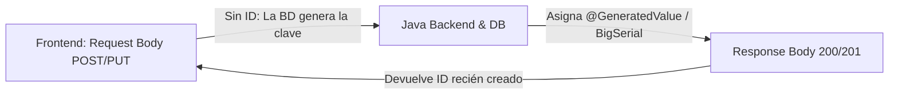

# 🔌 Contrato de API Endpoints y Comunicación Trilateral (Semana 2 / Fase 2)

Este documento contiene la especificación formal del **Contrato de API** dividida por cada capa del sistema (**Frontend**, **Backend Java** y **Backend Python FastAPI**), aplicando la plantilla homogénea estandarizada para todos los módulos.

---

## 📌 REGLA DE ORO ARQUITECTÓNICA: Manejo de `ID`s en Peticiones y Respuestas



1. **Peticiones de Creación (`POST` - Request Body):**
   * **El Frontend NUNCA envía el `id`**. Es una buena práctica estricta de REST API.
   * La clave primaria la genera automáticamente la Base de Datos (`@GeneratedValue(strategy = GenerationType.IDENTITY)`).
2. **Respuestas del Servidor (`Response Body` - 200 OK / 201 Created):**
   * **El Backend SIEMPRE devuelve el `id` recién generado** (ej: `"id": 15`) para que el Frontend pueda actualizar su estado en memoria o hacer referencias a ese elemento.
3. **Identificación de Sesión (`userId` via JWT):**
   * En peticiones autenticadas, el `userId` no necesita viajar en el body; Spring Security lo extrae automáticamente del token `Authorization: Bearer <JWT_TOKEN>`.

---

## 🔑 MÓDULO 1: AUTENTICACIÓN Y REGISTRO

---

### 1.1 REGISTRO DE CUENTA DE USUARIO

#### 💻 CONTRATO FRONTEND
*   **Ruta UI en Navegador (Angular Router):** `http://localhost:4200/register` (`RegisterComponent`)
*   **Endpoint REST al que dispara la petición HTTP:** `POST http://localhost:8080/api/auth/register`
*   **JSON a Enviar (Request Body ➔ Java):**
    ```json
    {
      "nombre": "Carlos Mendoza",
      "email": "carlos.mendoza@nocountry.com",
      "password": "Password123!"
    }
    ```
*   **JSON a Recibir (Response Body 201 Created):**
    ```json
    {
      "id": 1,
      "nombre": "Carlos Mendoza",
      "email": "carlos.mendoza@nocountry.com",
      "estado": "ACTIVO",
      "fechaRegistro": "2026-07-27T03:55:00"
    }
    ```

---

#### ☕ CONTRATO BACKEND JAVA (Spring Boot)
*   **Controlador Java:** `AuthController.java`
*   **Anotaciones de Controlador:**
    ```java
    @RestController
    @RequestMapping("/api/auth")
    public class AuthController {

        @PostMapping("/register")
        public ResponseEntity<UsuarioResponseDto> registrar(@RequestBody UsuarioRequestDto dto) { ... }
    }
    ```
*   **Endpoint REST Expuesto:** `POST /api/auth/register`
*   **JSON a Recibir (Request Body desde Frontend):**
    ```json
    {
      "nombre": "Carlos Mendoza",
      "email": "carlos.mendoza@nocountry.com",
      "password": "Password123!"
    }
    ```
*   **JSON a Devolver (Response Body a Frontend - 201 Created):**
    ```json
    {
      "id": 1,
      "nombre": "Carlos Mendoza",
      "email": "carlos.mendoza@nocountry.com",
      "estado": "ACTIVO",
      "fechaRegistro": "2026-07-27T03:55:00"
    }
    ```
*   *Nota:* Registra directamente en PostgreSQL (tabla `usuarios` con hash BCrypt).

---

#### 🐍 CONTRATO BACKEND PYTHON (FastAPI / Data Science)
*   **Endpoint Intermedio:** `N/A` *(No aplica para el registro)*.

---

### 1.2 INICIO DE SESIÓN (LOGIN)

#### 💻 CONTRATO FRONTEND
*   **Ruta UI en Navegador (Angular Router):** `http://localhost:4200/login` (`LoginComponent`)
*   **Endpoint REST al que dispara la petición HTTP:** `POST http://localhost:8080/api/auth/login`
*   **JSON a Enviar (Request Body ➔ Java):**
    ```json
    {
      "email": "carlos.mendoza@nocountry.com",
      "password": "Password123!"
    }
    ```
*   **JSON a Recibir (Response Body 200 OK):**
    ```json
    {
      "token": "eyJhbGciOiJIUzI1NiJ9...",
      "tokenType": "Bearer",
      "usuario": {
        "id": 1,
        "nombre": "Carlos Mendoza",
        "email": "carlos.mendoza@nocountry.com"
      }
    }
    ```

---

#### ☕ CONTRATO BACKEND JAVA (Spring Boot)
*   **Controlador Java:** `AuthController.java`
*   **Anotaciones de Controlador:**
    ```java
    @RestController
    @RequestMapping("/api/auth")
    public class AuthController {

        @PostMapping("/login")
        public ResponseEntity<LoginResponseDto> login(@RequestBody LoginRequestDto dto) { ... }
    }
    ```
*   **Endpoint REST Expuesto:** `POST /api/auth/login`
*   **JSON a Recibir (Request Body desde Frontend):**
    ```json
    {
      "email": "carlos.mendoza@nocountry.com",
      "password": "Password123!"
    }
    ```
*   **JSON a Devolver (Response Body a Frontend - 200 OK):**
    ```json
    {
      "token": "eyJhbGciOiJIUzI1NiJ9...",
      "tokenType": "Bearer",
      "usuario": {
        "id": 1,
        "nombre": "Carlos Mendoza",
        "email": "carlos.mendoza@nocountry.com"
      }
    }
    ```

---

#### 🐍 CONTRATO BACKEND PYTHON (FastAPI / Data Science)
*   **Endpoint Intermedio:** `N/A` *(No aplica para el login)*.

---

## 📊 MÓDULO 2: DASHBOARD GENERAL

---

### 2.1 TARJETAS DE MÉTRICAS RESUMEN (KPI CARDS)

#### 💻 CONTRATO FRONTEND
*   **Ruta UI en Navegador (Angular Router):** `http://localhost:4200/dashboard` (`KpiCardsComponent`)
*   **Endpoint REST al que dispara la petición HTTP:** `GET http://localhost:8080/api/dashboard/resumen/1`
*   **JSON a Recibir (Response Body 200 OK desde Java):**
    ```json
    {
      "ingresosMensuales": 4500.00,
      "gastosTotales": 2470.00,
      "balanceNeto": 2030.00,
      "tasaAhorro": 45.11
    }
    ```

---

#### ☕ CONTRATO BACKEND JAVA (Spring Boot)
*   **Controlador Java:** `DashboardController.java`
*   **Anotaciones de Controlador:**
    ```java
    @RestController
    @RequestMapping("/api/dashboard")
    public class DashboardController {

        @GetMapping("/resumen/{usuarioId}")
        public ResponseEntity<ResumenKpiDto> obtenerResumen(@PathVariable Long usuarioId) { ... }
    }
    ```
*   **Endpoint REST Expuesto:** `GET /api/dashboard/resumen/{usuarioId}`
*   **JSON a Devolver (Response Body a Frontend - 200 OK):**
    ```json
    {
      "ingresosMensuales": 4500.00,
      "gastosTotales": 2470.00,
      "balanceNeto": 2030.00,
      "tasaAhorro": 45.11
    }
    ```
*   *Nota de Implementación (JPA Agnóstico):* Consulta los valores agregados usando Spring Data JPA Repositories (`perfilFinancieroRepository.findByUsuarioId` y `transaccionRepository.findByUsuarioIdAndTipo`), calculando `balanceNeto` y `tasaAhorro` en el servicio sin usar SQL nativo.

---

#### 🐍 CONTRATO BACKEND PYTHON (FastAPI / Data Science)
*   **Endpoint Intermedio:** `N/A` *(No aplica. Cálculo aritmético consolidado internamente por Java Spring Boot)*.

---

### 2.2 DISTRIBUCIÓN DE GASTOS (DONUT CHART CON IA NLP)

#### 💻 CONTRATO FRONTEND
*   **Ruta UI en Navegador (Angular Router):** `http://localhost:4200/dashboard` (`DonutChartComponent`)
*   **Endpoint REST al que dispara la petición HTTP:** `GET http://localhost:8080/api/transacciones/usuario/1/distribucion`
*   **JSON a Recibir (Response Body 200 OK desde Java):**
    ```json
    [
      { "categoria": "Alimentación", "montoTotal": 850.00, "porcentaje": 34.41, "color": "#3357FF", "icono": "shopping-cart" },
      { "categoria": "Transporte", "montoTotal": 320.00, "porcentaje": 12.95, "color": "#28A745", "icono": "bus" },
      { "categoria": "Ocio", "montoTotal": 200.00, "porcentaje": 8.09, "color": "#00BCD4", "icono": "film" },
      { "categoria": "Vivienda", "montoTotal": 700.00, "porcentaje": 28.34, "color": "#FFC107", "icono": "home" }
    ]
    ```

---

#### ☕ CONTRATO BACKEND JAVA (Spring Boot)
*   **Controlador Java:** `TransaccionController.java`
*   **Anotaciones de Controlador:**
    ```java
    @RestController
    @RequestMapping("/api/transacciones")
    public class TransaccionController {

        @GetMapping("/usuario/{usuarioId}/distribucion")
        public ResponseEntity<List<DistribucionCategoriaDto>> obtenerDistribucion(@PathVariable Long usuarioId) { ... }
    }
    ```
*   **Endpoint REST Expuesto:** `GET /api/transacciones/usuario/{usuarioId}/distribucion`
*   **🧪 PRUEBA EN POSTMAN (Petición Interna que Java realiza a Python FastAPI):**
    *   **Método HTTP:** `POST`
    *   **URL Interna (FastAPI):** `http://localhost:8000/api/v1/classify-transactions`
    *   **Request Payload enviado por Java:**
        ```json
        {
          "transacciones": [
            { "id": 15, "text": "Supermercado Plaza", "monto": 420.00 },
            { "id": 16, "text": "Gasolinera Repsol", "monto": 300.00 }
          ]
        }
        ```
    *   **Response Payload recibido desde Python (200 OK):**
        ```json
        {
          "clasificados": [
            { "id": 15, "categoriaPredicha": "Alimentación", "monto": 420.00 },
            { "id": 16, "categoriaPredicha": "Transporte", "monto": 300.00 }
          ]
        }
        ```
*   **Procesamiento posterior en Java (Patrón de Auto-Registro / Resiliencia):**
    1. Java recibe la `categoriaPredicha` desde Python (ej: `"Alimentación"` o una nueva como `"Mascotas"`).
    2. Java busca la categoría en BD: `Optional<Categoria> catOpt = categoriaRepository.findByNombre(categoriaPredicha)`.
    3. **SI EXISTE EN BD:** Java obtiene `id`, `color` e `icono` existentes.
    4. **SI NO EXISTE EN BD:** Java **CREA Y REGISTRA DINÁMICAMENTE** la nueva categoría en la tabla `categorias` (Nombre: `"Mascotas"`, Color: `#6C757D`, Icono: `"tag"`).
    5. Java actualiza `categoria_id` en la tabla `transacciones`.
*   **JSON a Devolver al Frontend (Response Body - 200 OK):**
    ```json
    [
      { "categoria": "Alimentación", "montoTotal": 850.00, "porcentaje": 34.41, "color": "#3357FF", "icono": "shopping-cart" },
      { "categoria": "Transporte", "montoTotal": 320.00, "porcentaje": 12.95, "color": "#28A745", "icono": "bus" }
    ]
    ```

---

#### 🐍 CONTRATO BACKEND PYTHON (FastAPI / Data Science)
*   **Controlador Python (FastAPI):** `routers/classifier.py`
*   **Anotaciones / Decorador FastAPI:**
    ```python
    @app.post("/api/v1/classify-transactions")
    def classify_transactions(request: ClassifyRequestDto):
        # Lógica de clasificación NLP / Scikit-Learn (Sin conexión a BD)
    ```
*   **Endpoint REST Expuesto (Solo consumido por Java):** `POST /api/v1/classify-transactions`
*   **JSON a Recibir (Request Body desde Java Backend):**
    ```json
    {
      "transacciones": [
        { "id": 15, "text": "Supermercado Plaza", "monto": 420.00 },
        { "id": 16, "text": "Gasolinera Repsol", "monto": 300.00 }
      ]
    }
    ```
*   **JSON a Devolver (Response Body a Java Backend - 200 OK):**
    ```json
    {
      "clasificados": [
        { "id": 15, "categoriaPredicha": "Alimentación", "monto": 420.00 },
        { "id": 16, "categoriaPredicha": "Transporte", "monto": 300.00 }
      ]
    }
    ```

---

### 2.3 DIAGNÓSTICO DE SALUD FINANCIERA (EL CORAZÓN DEL PROYECTO - MVP OBLIGATORIO)

#### 💻 CONTRATO FRONTEND
*   **Ruta UI en Navegador (Angular Router):** `http://localhost:4200/dashboard` (`AnalisisIaCardComponent`)
*   **Endpoint REST al que dispara la petición HTTP:** `POST http://localhost:8080/api/analisis-financiero`
*   **🧪 CASO A (Modo Evaluador Jueces / Postman / Caso Oficial):**
    ```json
    {
      "ingreso_mensual": 4500.00,
      "nivel_endeudamiento": 25.00,
      "frecuencia_ahorro": "Media",
      "transacciones": [
        { "descripcion": "Supermercado", "valor": 420.00 },
        { "descripcion": "Combustible", "valor": 300.00 },
        { "descripcion": "Streaming", "valor": 40.00 }
      ]
    }
    ```
*   **🚀 CASO B (Modo Producción App Real Angular):**
    ```json
    {
      "userId": 1,
      "mes": 7,
      "anio": 2026
    }
    ```
*   **JSON a Recibir (Response Body 200 OK desde Java):**
    ```json
    {
      "perfil_financiero": "En observación",
      "probabilidad": 0.82,
      "resumen_gastos": {
        "alimentacion": 420.00,
        "transporte": 300.00,
        "entretenimiento": 40.00
      },
      "recomendaciones": [
        "Monitorear los gastos recurrentes de entretenimiento",
        "Aumentar la reserva financiera mensual"
      ]
    }
    ```

---

#### ☕ CONTRATO BACKEND JAVA (Spring Boot)
*   **Controlador Java:** `AnalisisController.java`
*   **Anotaciones de Controlador:**
    ```java
    @RestController
    @RequestMapping("/api/analisis-financiero")
    public class AnalisisController {

        @PostMapping
        public ResponseEntity<AnalisisResponseDto> calcularAnalisis(@RequestBody AnalisisRequestDto dto) { ... }
    }
    ```
*   **Endpoint REST Expuesto:** `POST /api/analisis-financiero`
*   **🧪 PRUEBA EN POSTMAN (Petición Interna que Java realiza a Python FastAPI):**
    *   **Método HTTP:** `POST`
    *   **URL Interna (FastAPI):** `http://localhost:8000/api/v1/predict-health`
    *   **Patrón Híbrido en Java:**
        - Si el request trae `transacciones` (Caso A - Jueces), las envía directamente a Python.
        - Si viene sin `transacciones` (Caso B - Producción), Java consulta las transacciones del mes en BD (`transaccionRepository.findByUsuarioIdAndMes(userId, mesActual)`).
    *   **Request Payload enviado por Java a Python:**
        ```json
        {
          "ingreso_mensual": 4500.00,
          "nivel_endeudamiento": 25.00,
          "frecuencia_ahorro": "Media",
          "transacciones": [
            { "descripcion": "Supermercado", "valor": 420.00 },
            { "descripcion": "Combustible", "valor": 300.00 },
            { "descripcion": "Streaming", "valor": 40.00 }
          ]
        }
        ```
    *   **Response Payload recibido desde Python (200 OK):**
        ```json
        {
          "perfil_financiero": "En observación",
          "probabilidad": 0.82,
          "resumen_gastos": {
            "alimentacion": 420.00,
            "transporte": 300.00,
            "entretenimiento": 40.00
          },
          "recomendaciones": [
            "Monitorear los gastos recurrentes de entretenimiento",
            "Aumentar la reserva financiera mensual"
          ]
        }
        ```
*   **Persistencia Snapshot en BD:** Java inserta la fila de auditoría en `analisis_historial` y `recomendaciones_historial`.
*   **JSON a Devolver al Frontend (Response Body - 200 OK):**
    ```json
    {
      "perfil_financiero": "En observación",
      "probabilidad": 0.82,
      "resumen_gastos": {
        "alimentacion": 420.00,
        "transporte": 300.00,
        "entretenimiento": 40.00
      },
      "recomendaciones": [
        "Monitorear los gastos recurrentes de entretenimiento",
        "Aumentar la reserva financiera mensual"
      ]
    }
    ```

---

#### 🐍 CONTRATO BACKEND PYTHON (FastAPI / Data Science)
*   **Controlador Python (FastAPI):** `routers/health_predictor.py`
*   **Anotaciones / Decorador FastAPI:**
    ```python
    @app.post("/api/v1/predict-health")
    def predict_health(request: PredictHealthDto):
        # Inferencia ML Scikit-Learn .joblib + NLP resumen_gastos
    ```
*   **Endpoint REST Expuesto (Solo consumido por Java):** `POST /api/v1/predict-health`
*   **JSON a Recibir (Request Body desde Java Backend):**
    ```json
    {
      "ingreso_mensual": 4500.00,
      "nivel_endeudamiento": 25.00,
      "frecuencia_ahorro": "Media",
      "transacciones": [
        { "descripcion": "Supermercado", "valor": 420.00 },
        { "descripcion": "Combustible", "valor": 300.00 },
        { "descripcion": "Streaming", "valor": 40.00 }
      ]
    }
    ```
*   **JSON a Devolver (Response Body a Java Backend - 200 OK):**
    ```json
    {
      "perfil_financiero": "En observación",
      "probabilidad": 0.82,
      "resumen_gastos": {
        "alimentacion": 420.00,
        "transporte": 300.00,
        "salud": 0.00,
        "vivienda": 0.00,
        "educacion": 0.00,
        "ocio": 40.00,
        "servicios": 0.00,
        "otros": 0.00
      },
      "recomendaciones": [
        "Monitorear los gastos recurrentes de ocio y entretenimiento",
        "Aumentar la reserva financiera mensual"
      ]
    }
    ```

---

### 2.4 TRANSACCIONES RECIENTES (WIDGET INFERIOR)

#### 💻 CONTRATO FRONTEND
*   **Ruta UI en Navegador (Angular Router):** `http://localhost:4200/dashboard` (`TransaccionesRecientesWidget`)
*   **Endpoint REST al que dispara la petición HTTP:** `GET http://localhost:8080/api/transacciones/usuario/1/recientes?limit=5`
*   **JSON a Recibir (Response Body 200 OK desde Java):**
    ```json
    [
      {
        "id": 15,
        "descripcion": "Supermercado Plaza",
        "fecha": "2026-07-10",
        "categoriaNombre": "Alimentación",
        "monto": 420.00,
        "tipo": "GASTO"
      }
    ]
    ```

---

#### ☕ CONTRATO BACKEND JAVA (Spring Boot)
*   **Controlador Java:** `TransaccionController.java`
*   **Anotaciones de Controlador:**
    ```java
    @RestController
    @RequestMapping("/api/transacciones")
    public class TransaccionController {

        @GetMapping("/usuario/{usuarioId}/recientes")
        public ResponseEntity<List<TransaccionResponseDto>> obtenerRecientes(
                @PathVariable Long usuarioId,
                @RequestParam(defaultValue = "5") int limit) { ... }
    }
    ```
*   **Endpoint REST Expuesto:** `GET /api/transacciones/usuario/{usuarioId}/recientes?limit=5`
*   **Lógica de Implementación (JPA Agnóstico):** Java ejecuta `transaccionRepository.findByUsuarioIdOrderByFechaDesc(usuarioId, PageRequest.of(0, limit))`.
*   **JSON a Devolver (Response Body a Frontend - 200 OK):**
    ```json
    [
      {
        "id": 15,
        "descripcion": "Supermercado Plaza",
        "fecha": "2026-07-10",
        "categoriaNombre": "Alimentación",
        "monto": 420.00,
        "tipo": "GASTO"
      }
    ]
    ```

---

#### 🐍 CONTRATO BACKEND PYTHON (FastAPI / Data Science)
*   **Endpoint Intermedio:** `N/A` *(Consulta de lectura directa administrada al 100% por Java Spring Boot)*.
