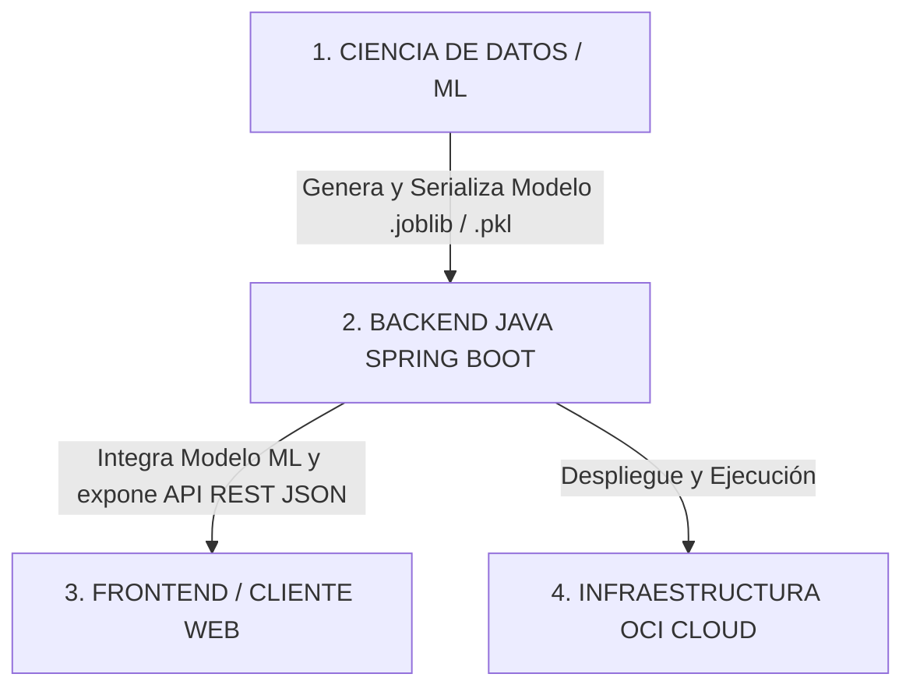

# 📋 Separación Oficial de Roles y Responsabilidades (Según Especificaciones del Caso Hackathon)

Este documento detalla la división formal de responsabilidades entre los roles del equipo, extraída de las especificaciones oficiales del Hackathon **Alura + Oracle (G9)**.

---

## 🏛️ Flujo General de Arquitectura entre Roles



---

## 🧠 1. ROL: CIENCIA DE DATOS (Data Science / Machine Learning)
> **Misión:** Diseñar la inteligencia del sistema, procesar las variables financieras y entrenar los modelos de clasificación y diagnóstico.

### 📦 Entregable Obligatorio:
Notebook de Jupyter (`.ipynb`) + Archivo ejecutable del modelo serializado (`.joblib` o `.pkl`).

### ⚙️ Responsabilidades Técnicas (`caso` - Líneas 62-76 y 195-213):
1. **Exploración y Limpieza de Datos (EDA):** Construir y normalizar el dataset financiero de entrenamiento.
2. **Procesamiento de Variables:**
   - Variables Financieras: `ingreso_mensual`, `nivel_endeudamiento`, `frecuencia_ahorro`.
   - Variables Textuales: `descripcion` de las transacciones (ej: "Supermercado", "Gasolinera").
3. **Ingeniería de Atributos (Feature Engineering):** Vectorización y extracción de patrones de consumo.
4. **Modelo Clasificador de Gastos:** Algoritmo que asigna automáticamente una categoría (`Alimentación`, `Transporte`, `Vivienda`, `Salud`, `Educación`, `Ocio`, `Servicios`).
5. **Modelo de Diagnóstico de Perfil Financiero:** Algoritmo de ML que evalúa la salud económica en `Saludable`, `En observación` o `En riesgo` y calcula la `probabilidad` de precisión (ej: `0.82`).
6. **Generador de Recomendaciones:** Reglas/modelo para sugerir consejos accionables simples (ej: *"Aumentar la reserva financiera mensual"*).
7. **Serialización del Modelo:** Exportar el modelo entrenado como archivo ejecutable binario (`.joblib`/`.pkl`) para su integración con el Backend.

---

## ☕ 2. ROL: BACK-END (Java Spring Boot)
> **Misión:** Servidor web orquestador que valida entradas, gestiona la persistencia, integra el modelo de ML y expone la API REST JSON.

### 📦 Entregable Obligatorio:
API REST documentada y ejecutable basada en Java con Spring Boot.

### ⚙️ Responsabilidades Técnicas (`caso` - Líneas 75-84 y 215-225):
1. **Exposición de la API REST:** Exponer el endpoint principal obligatorio `POST /api/analisis-financiero` y los endpoints de soporte (`POST /api/transacciones`, `GET /api/categorias`, etc.).
2. **Validación de Entrada & Manejo de Errores:**
   - Validar que los JSONs entrantes no contengan nulos, valores negativos ni formatos corruptos.
   - Retornar códigos de estado HTTP estandarizados (`200 OK`, `201 Created`, `400 Bad Request`, `500 Internal Server Error`).
3. **Integración con Ciencia de Datos:** Cargar en memoria el archivo del modelo serializado (`.joblib`) o consumir el microservicio para ejecutar la inferencia de ML.
4. **Respuesta Estructurada JSON:** Devolver al cliente el objeto JSON oficial del caso:
   ```json
   {
     "perfil_financiero": "En observación",
     "probabilidad": 0.82,
     "resumen_gastos": { "alimentacion": 420, "transporte": 300 },
     "recomendaciones": [ "Monitorear gastos de entretenimiento" ]
   }
   ```
5. **Documentación de la API:** Documentar las rutas y parámetros con OpenAPI / Swagger.

---

## ☁️ 3. ROL: INFRAESTRUCTURA Y NUBE (Oracle Cloud Infrastructure - OCI)
> **Misión:** Proveer los servicios en la nube para el almacenamiento de artefactos y el despliegue del sistema.

### 📦 Entregable Obligatorio:
Integración activa de al menos **1 servicio OCI** en la arquitectura (`caso` - Líneas 85-95 y 227-229).

### ⚙️ Opciones de Infraestructura OCI:
1. **OCI Object Storage:** Almacenamiento tipo Bucket para los modelos de ML serializados (`.joblib`) o datasets.
2. **OCI Compute:** Instancia de servidor virtual Linux/Windows para alojar y ejecutar la aplicación Java Backend.
3. **OCI Autonomous Database:** Base de datos relacional administrada en la nube OCI.

---

## 💻 4. ROL: FRONTEND (Cliente Web / Angular)
> **Misión:** Interfaz de usuario interactiva (Dashboard) que captura las entradas y visualiza los resultados del análisis.

### ⚙️ Responsabilidades Técnicas:
1. **Maquetación del Dashboard:** Diseñar la interfaz visual en 4 niveles (Header, Tarjetas KPI, Donut Chart, Diagnóstico IA y Transacciones Recientes).
2. **Formularios de Captura:** Formularios de Registro, Login y Registro de Movimientos.
3. **Cliente HTTP:** Enviar y recibir los JSONs definidos mediante `HttpClient` conectándose al Backend Java.
