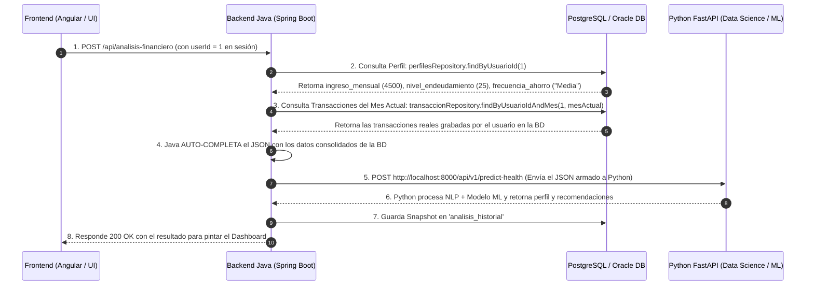

# 💡 Desglose Técnico: Flujo Real de Transacciones, No Duplicidad y Reutilización del Endpoint

Este documento responde de forma exhaustiva a las 4 preguntas clave de arquitectura planteadas sobre el flujo de transacciones, la intervención de la Base de Datos, la no duplicidad y la reutilización del endpoint principal.

---

## 🔍 1. ¿Por qué el documento del Hackathon (`caso`) muestra el JSON con las transacciones escritas a mano?

El JSON de ejemplo presentado en el documento oficial del Hackathon:
```json
{
  "ingreso_mensual": 4500,
  "nivel_endeudamiento": 25,
  "frecuencia_ahorro": "Media",
  "transacciones": [
    { "descripcion": "Supermercado", "valor": 420 },
    { "descripcion": "Combustible", "valor": 300 }
  ]
}
```
es un **Modo de Prueba Aislada para Evaluación Automática (Evaluador del Hackathon)**. 
Los jueces del Hackathon probarán la API REST enviando un JSON directo en Postman sin estar autenticados ni depender de datos previos en una base de datos.

---

## 🚀 2. ¿Cómo funciona en la APLICACIÓN REAL (Frontend + Java + BD)?

En la aplicación real desplegada en producción, el usuario no escribe las transacciones a mano cada vez que entra al Dashboard.

### 🔄 Flujo Real en Producción (Mes Actual / Rango de Fechas):



#### 📌 Conclusión Clave & Patrón Híbrido en Java (Evaluador vs. Producción):
Para garantizar que la API cumpla tanto con las pruebas automáticas del Hackathon como con la aplicación real en producción, Java Spring Boot implementa un **Fallback Híbrido** en el controlador `POST /api/analisis-financiero`:

```java
// Lógica de Fallback Híbrido en AnalisisController.java
if (request.getTransacciones() != null && !request.getTransacciones().isEmpty()) {
    // 🧪 MODO JUECES / POSTMAN: Petición estática con transacciones enviadas a mano
    transaccionesAProcesar = request.getTransacciones();
} else {
    // 🚀 MODO PRODUCCIÓN / ANGULAR: Java consulta las transacciones del mes en la BD
    transaccionesAProcesar = transaccionRepository.findByUsuarioIdAndMes(userId, mesActual);
}
```

De esta forma, la API funciona **al 100% tanto si un juez manda un JSON estático por Postman como si un usuario interactúa desde el Frontend con la Base de Datos**.

---

## 🛡️ 3. ¿Cómo garantizamos la NO DUPLICIDAD de Clasificación en la BD?

Esta es una **optimización crítica de arquitectura de datos**:

### 🧠 ¿Qué pasa si una transacción YA fue clasificada en la BD?

1. **Transacciones Existentes en BD (`categoria_id IS NOT NULL`):**
   Cuando el usuario consulta el Dashboard o dispara el Diagnóstico de Salud IA, Java verifica la tabla `transacciones`. Si la transacción **ya tiene asignado un `categoria_id` (ej: `categoria_id = 1` Alimentación)**, Java **NO** vuelve a enviar el texto a la IA de Python para re-clasificarlo desde cero. Java realiza la consulta directa agregada via JPA/SQL (`GROUP BY categoria_id`).

2. **Transacciones Nuevas o Pendientes (`categoria_id IS NULL`):**
   Únicamente cuando ingresa un nuevo movimiento sin categoría, Java invoca a Python FastAPI (`POST /api/v1/classify-transactions`) para que la IA prediga la categoría por primera y única vez. Java guarda el `categoria_id` en la BD y **nunca más vuelve a llamar a la IA para esa misma transacción**.

3. **Prueba Aislada del Hackathon (JSON Estático de Jueces en Postman):**
   Si la petición viene del evaluador del Hackathon con descripciones en texto raw (`"Supermercado"`, `"Combustible"`), como no existen previamente en la BD, Python clasifica el arreglo al vuelo en memoria y devuelve el objeto `resumen_gastos`.

> **📌 Principio de Eficiencia:** "Clasifica con IA una sola vez, persiste la relación en BD y reutiliza el `categoria_id` para todas las lecturas futuras."

---

## ♻️ 4. Reutilización Futura del mismo Endpoint en Múltiples Secciones

El resultado procesado por este endpoint (`POST /api/analisis-financiero` o `GET /api/analisis/usuario/{userId}/ultimo`) se **recicla en 4 pantallas diferentes del Frontend**:

1. **📊 1. Dashboard General (Nivel 3 Derecha):** Pinta el badge `• En observación`, probabilidad `82%` y las 2 primeras recomendaciones.
2. **🤖 4. Simulador IA:** Consume el endpoint para calcular qué pasaría con el perfil si el usuario reduce gastos en `$500`.
3. **💡 6. Sugerencias IA:** Muestra la lista completa y detallada de recomendaciones históricas.
4. **📄 8. Informes:** Incluye la evaluación del perfil en la exportación del reporte mensual PDF.
