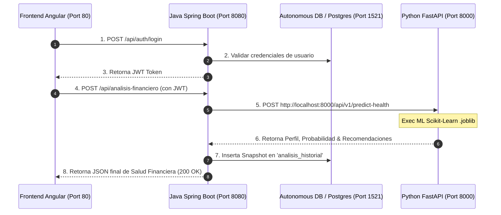

# ☁️ Plan de Despliegue en Oracle Cloud Infrastructure (OCI) y Configuración Trilateral

Este documento establece el plan técnico detallado para el despliegue en producción de la plataforma **Finance AI** en **Oracle Cloud Infrastructure (OCI)**, integrando los 3 componentes del sistema (**Frontend Angular**, **Backend Java Spring Boot** y **Backend Python FastAPI ML**) junto con la base de datos relacional y el almacenamiento de modelos en OCI Object Storage.

---

## 📌 CABECERA TÉCNICA: Tabla de Archivos, Puertos y Variables a Configurar

| Componente | Archivo de Configuración | Puerto Interno | Puerto Público (Nginx) | Host Producción (OCI) | Variables Clave de Entorno / Propiedades |
| :--- | :--- | :---: | :---: | :---: | :--- |
| **Frontend (Angular)** | `frontend/src/environments/environment.prod.ts` | `4200` | `80` / `443` | `http://<IP_OCI>` o `https://midominio.com` | `apiUrl: '/api'`<br>`fastApiUrl: '/api/v1'` *(Rutas relativas invisibles)* |
| **Backend (Java Spring Boot)** | `backend/src/main/resources/application.properties` | `8080` | Oculto tras `/api` | `http://localhost:8080` *(proxy Nginx)* | `server.port=8080`<br>`spring.datasource.url=jdbc:oracle:thin:@...`<br>`python.ml.service.url=http://localhost:8000` |
| **Backend ML (Python FastAPI)** | `finance-ai-ml/.env`<br>`finance-ai-ml/main.py` | `8000` | Oculto tras `/api/v1` | `http://localhost:8000` *(proxy Nginx)* | `PORT=8000`<br>`HOST=127.0.0.1`<br>`MODEL_PATH=app/infrastructure/artifacts/` |
| **Base de Datos (Autonomous DB)** | OCI DB Console / Wallet | `1521` | Oculto (Privado) | `<DB_HOST_OCI>` | Connection String, Wallet mTLS (`TNS_ADMIN`) |

> 💡 **ACLARACIÓN DE ARQUITECTURA DE DOMINIO Y PUERTOS:**
> * **En Desarrollo (Local):** Se usan puertos explícitos (`4200` Angular, `8080` Java, `8000` Python) porque todos corren en la misma máquina local.
> * **En Producción (Nube OCI):** El usuario final **NUNCA escribe ni ve los puertos `:8080` ni `:8000`**. Accede únicamente mediante un link limpio o nombre de dominio (`http://<IP_OCI>` o `https://finance-ai.com`).
> * **Nginx (Proxy Inverso):** Recibe las peticiones en el puerto estándar `80`/`443` y redirige internamente a Spring Boot (8080) y FastAPI (8000) de forma totalmente transparente e invisible.

---

## 🚀 PASO 1: Configuración de la Infraestructura Base en OCI (Red y Seguridad)

### 1.1 Tenencia y Compartimentos
1. **Tenencia (Tenancy):** Acceder a la consola de Oracle Cloud Infrastructure (OCI).
2. **Compartimento:** Crear un compartimento dedicado para aislar los recursos del proyecto:
   * **Nombre:** `cmp-finance-ai-prod`
   * **Descripción:** Compartimento de recursos en producción para Finance AI (Hackathon Oracle).

### 1.2 Red Virtual en la Nube (VCN) y Subredes
1. Crear una **VCN (Virtual Cloud Network)** llamada `vcn-finance-ai` con el bloque CIDR `10.0.0.0/16`.
2. Crear una **Subred Pública** (`subnet-public-finance-ai`, CIDR `10.0.1.0/24`) para alojar la IP Pública de los servicios Web, Backend y FastAPI.
3. Crear una **Subred Privada** (`subnet-private-finance-ai`, CIDR `10.0.2.0/24`) para alojar la instancia de Base de Datos.

### 1.3 Reglas de Firewall e Ingress Rules (Security Lists)
En la lista de seguridad de la subred pública (`Default Security List for vcn-finance-ai`), añadir las siguientes reglas de entrada (**Ingress Rules**):

| Protocolo | Origen (CIDR) | Puerto Destino | Propósito |
| :---: | :---: | :---: | :--- |
| **TCP** | `0.0.0.0/0` | `80` / `443` | Tráfico web público para el Frontend Angular (Nginx) |
| **TCP** | `0.0.0.0/0` | `8080` | Endpoint REST del Backend Java Spring Boot |
| **TCP** | `0.0.0.0/0` | `8000` | Endpoint REST del Microservicio Python FastAPI ML |
| **TCP** | `0.0.0.0/0` | `22` | Acceso SSH seguro para administración de la VM |
| **TCP** | `10.0.0.0/16` | `1521` / `5432` | Conexión interna de base de datos desde la subred privada |

---

## 🗄️ PASO 2: Despliegue de la Base de Datos en OCI

### 2.1 Aprovisionamiento de Autonomous Database (ATP)
1. En el menú de OCI, navegar a **Oracle Database ➔ Autonomous Database**.
2. Seleccionar el tipo de carga de trabajo: **Transaction Processing (ATP)**.
3. Configurar nombre de la base de datos: `financeaidb`.
4. Definir la contraseña del usuario `ADMIN`.
5. Descargar el archivo **Wallet de Conexión (`Wallet_financeaidb.zip`)** para la autenticación mTLS segura.

### 2.2 Configuración del Backend Java (Spring Boot)
1. Descomprimir el Wallet en el servidor backend en la ruta `/opt/oracle/wallets/financeaidb`.
2. Actualizar las propiedades en `backend/src/main/resources/application.properties`:
   ```properties
   # Conexión Oracle Autonomous Database en OCI
   spring.datasource.url=jdbc:oracle:thin:@financeaidb_high?TNS_ADMIN=/opt/oracle/wallets/financeaidb
   spring.datasource.username=ADMIN
   spring.datasource.password=${DB_PASSWORD}
   spring.datasource.driver-class-name=oracle.jdbc.OracleDriver

   # Estrategia de JPA/Hibernate
   spring.jpa.database-platform=org.hibernate.dialect.OracleDialect
   spring.jpa.hibernate.ddl-auto=update
   spring.jpa.show-sql=false
   ```
3. *Nota:* Al iniciar Spring Boot, Hibernate generará automáticamente todas las tablas (`usuarios`, `transacciones`, `categorias`, `perfiles_financieros`, `analisis_historial`, `recomendaciones_historial`).

---

## 📦 PASO 3: Almacenamiento y Despliegue del Microservicio Python (FastAPI / ML)

### 3.1 Serialización de Artefactos ML y OCI Object Storage
1. **Entrenamiento Local:** Ejecutar el script `python train_model.py` en `finance-ai-ml/`.
2. **Serialización:** Generar los archivos binarios compilados:
   * `scaler.joblib`
   * `model_health.joblib`
   * `tfidf_vectorizer.joblib`
3. **OCI Object Storage:**
   * Crear un Bucket en OCI Object Storage llamado `finance-ai-ml-models` con acceso privado.
   * Subir los artefactos `.joblib` al Bucket como almacenamiento persistente de respaldo.

### 3.2 Despliegue del Microservicio FastAPI en OCI
1. En la VM Compute de OCI, instalar Python 3.10+ y virtualenv.
2. Clonar el repositorio e instalar las dependencias:
   ```bash
   cd finance-ai-ml
   pip install -r requirements.txt
   ```
3. Cargar los modelos al iniciar la aplicación (gestionado automáticamente por `lifespan` en `main.py` consumiendo `load_ml_models()`).
4. Levantar el servicio con Uvicorn en el puerto `8000`:
   ```bash
   uvicorn main:app --host 0.0.0.0 --port 8000 --workers 2
   ```

---

## ☕ PASO 4: Despliegue del Backend Java Spring Boot

1. Compilar la aplicación localmente o en el servidor de CI/CD:
   ```bash
   cd backend
   mvn clean package -DskipTests
   ```
2. Transferir el archivo ejecutable `backend-0.0.1-SNAPSHOT.jar` a la VM Compute en OCI.
3. Ejecutar el servicio exponiendo el puerto `8080`:
   ```bash
   java -jar -Dspring.profiles.active=prod backend-0.0.1-SNAPSHOT.jar --server.port=8080
   ```
4. Configurar un servicio `systemd` (`/etc/systemd/system/finance-backend.service`) para asegurar que el proceso se reinicie automáticamente ante reinicios de la VM.

---

## 🎨 PASO 5: Despliegue del Frontend Angular (Nginx)

1. Ajustar el archivo de producción `frontend/src/environments/environment.prod.ts`:
   ```typescript
   export const environment = {
     production: true,
     apiUrl: 'http://<IP_PUBLICA_OCI>:8080/api',
     fastApiUrl: 'http://<IP_PUBLICA_OCI>:8000/api/v1'
   };
   ```
2. Compilar el paquete de producción de Angular:
   ```bash
   cd frontend
   ng build --configuration production
   ```
3. Transferir el contenido de la carpeta `dist/frontend/browser` al directorio Nginx `/var/www/html/finance-ai/`.
4. Configurar Nginx en `/etc/nginx/sites-available/finance-ai`:
   ```nginx
   server {
       listen 80;
       server_name <IP_PUBLICA_OCI>;

       root /var/www/html/finance-ai;
       index index.html;

       location / {
           try_files $uri $uri/ /index.html;
       }

       location /api/ {
           proxy_pass http://localhost:8080/api/;
           proxy_set_header Host $host;
           proxy_set_header X-Real-IP $remote_addr;
       }
   }
   ```
5. Reiniciar Nginx: `sudo systemctl restart nginx`.

---

## 🧪 PASO 6: Protocolo de Verificación e Integración Trilateral (Smoke Tests)



1. **Test 1 (Health Check FastAPI):** `GET http://<IP_PUBLICA_OCI>:8000/health` ➔ Responde `{"status": "ok"}`.
2. **Test 2 (Health Check Java):** `GET http://<IP_PUBLICA_OCI>:8080/api/dashboard/resumen/1` ➔ Responde 200 OK con resumen financiero.
3. **Test 3 (Flujo Completo IA):** Enviar `POST /api/analisis-financiero` desde Angular y verificar la clasificación por ML y la persistencia en la base de datos de OCI.
